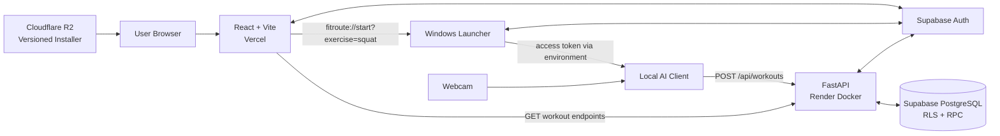
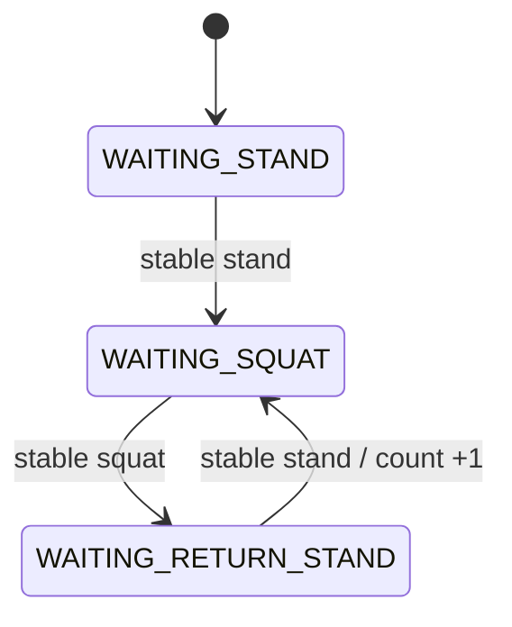
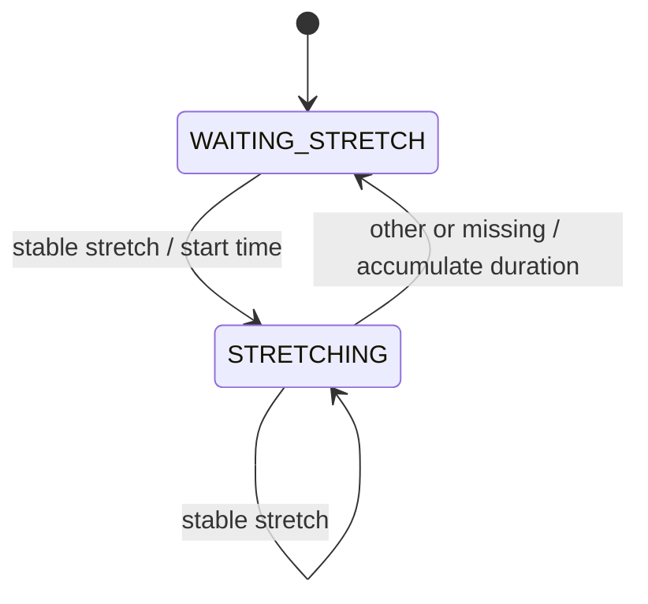
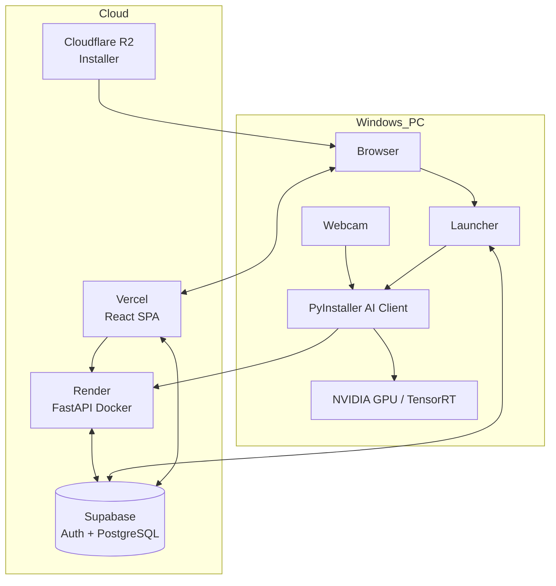

# FitRoute / AI Exercise Assistant — Portfolio Source

> 분석 기준: 현재 Repository의 실제 코드, 설정, SQL, 테스트, 배포 문서, release metadata, Git history를 교차 확인했다. README의 설명과 코드가 다를 때는 코드를 우선했다. 코드만으로 입증되지 않는 내용은 **Repository에서 확인 불가** 또는 **해석/잠재 과제**로 구분했다.

# 1. Project Summary

| 항목 | 확인 결과 | 근거 |
| --- | --- | --- |
| 프로젝트명 | **FitRoute / AI Exercise Assistant** | `README.md`, Frontend branding |
| 개발 기간 | **2026.09.04 ~ 2026.09.16 (README 기재)**. 현재 Git history는 2026.09.11 첫 commit부터 2026.09.17까지 확인됨 | `README.md`, `git log` |
| 개발 인원 | **1명, 개인 프로젝트** | `README.md`; Git author도 1개 identity만 확인됨 |
| 프로젝트 목적 | Webcam 기반 실시간 자세 분석 결과를 운동 세션으로 만들고, 인증된 사용자별 기록을 Cloud DB에 저장해 웹에서 조회·통계화 | AI Client, Backend, SQL, Frontend 코드 |
| 해결하려는 문제 | 모델 추론 데모만으로 끝나는 것이 아니라 설치, 인증, 실시간 추론, 운동 판정, 저장, 재시도, 조회, 배포까지 하나의 사용자 흐름으로 연결 | 전체 구조 |
| 핵심 사용자 | Windows PC와 Webcam, NVIDIA GPU 환경에서 AI 운동을 수행하고 웹에서 기록을 확인하는 사용자 | Installer/runtime 제약 및 UI |
| 최종 결과물 | React 웹 서비스, FastAPI API, Supabase DB/Auth, Windows Launcher, PyInstaller AI Client, Inno Setup Installer, release workflow | Repository 구성 |
| 전체 기술 스택 | Python, TypeScript, React 19, Vite 7, FastAPI, Pydantic, Supabase Auth/PostgreSQL/RLS, OpenCV, Ultralytics YOLO26n, TensorRT, MediaPipe Tasks, XGBoost, httpx, Docker, PyInstaller, Inno Setup, Vercel, Render, Cloudflare R2 | requirements/config/build files |

**한 문장 정의:** FitRoute는 로컬 GPU에서 `YOLO26n → MediaPipe → XGBoost → temporal/state logic`으로 운동을 분석하고, 결과를 인증 API와 PostgreSQL을 통해 웹 대시보드로 연결한 Windows 기반 End-to-End AI 운동 기록 서비스다.

# 2. Problem Definition

## 기존 운동 자세 분석 프로그램의 한계

- 프레임별 자세 class만 출력하면 운동의 시작·종료, 반복 횟수, 유지 시간 같은 사용자 가치로 곧바로 이어지지 않는다.
- Raw prediction은 순간 오분류와 pose 미검출에 흔들릴 수 있다. FitRoute는 연속 프레임 안정화와 상태 전이를 별도로 둔다.
- Notebook/CLI 모델 데모는 설치, Webcam 실행, 사용자 인증, 기록 보존, 실패 복구, 웹 조회를 제공하지 않는다.
- 브라우저에서 무거운 Windows/NVIDIA 추론 runtime을 직접 운영하기 어려워 웹 경험과 로컬 추론 프로세스 사이 연결이 필요하다.

## 단순 AI 데모와 실제 서비스의 차이

이 Repository는 모델 호출 외에도 다음을 구현한다.

1. `fitroute://` custom URI로 웹에서 Windows Launcher 호출
2. Windows Credential Manager 기반 refresh token 보관과 access token 전달
3. Webcam 실시간 inference, session lifecycle, pending/retry 저장
4. Bearer token 검증, Pydantic validation, RLS 및 atomic DB RPC
5. 일별 집계·세션 상세·주간/월간 통계를 제공하는 웹 UI
6. PyInstaller onedir, Inno Setup Installer, immutable release metadata와 rollback 절차

## 핵심 문제와 사용자 가치

**핵심 문제:** 서로 분리되기 쉬운 Computer Vision 추론과 실제 운동 기록 서비스를 안전하고 재현 가능한 하나의 흐름으로 연결하는 것.

**사용자 가치:** 사용자는 웹에서 운동을 시작하고, 로컬 AI 화면에서 즉시 자세/횟수/시간을 확인한 뒤, 종료된 결과를 날짜별 기록과 통계로 다시 볼 수 있다. 저장 실패 시 완료한 운동을 버리지 않고 한 건을 pending 상태로 유지해 재시도할 수 있다.

# 3. End-to-End System Flow

```text
React Web (로그인 / 스쿼트 선택)
  → fitroute://start?exercise=squat
Windows Launcher
  → URL whitelist 검증 + 중복 Camera process 차단
  → Supabase Desktop Auth / refresh token 복원
  → access token을 child process 환경변수로만 전달
AI Client
  → Webcam frame
  → YOLO26n person detection (TensorRT engine 우선, .pt fallback)
  → 가장 큰 bbox를 primary user로 선택
  → bbox에 30% padding 후 crop
  → MediaPipe PoseLandmarker (33 landmarks)
  → x/y/z/visibility를 펼친 132 features
  → XGBoost 9-class predict_proba
  → 연속 프레임 temporal smoothing
  → Squat state machine / Stretch duration logic
  → WorkoutSession summary
  → POST /api/workouts (Bearer access token)
FastAPI
  → Supabase Auth token 검증
  → record_workout_session RPC
PostgreSQL
  → workout_sessions 원본 row insert
  → daily_workout_summary atomic upsert
React Web
  → GET workout API
  → Dashboard / History / Statistics 표시
```

| 단계 | 실제 모듈/함수 | 핵심 기술 |
| --- | --- | --- |
| 웹 실행 요청 | `frontend/src/lib/desktopClient.ts`의 `requestDesktopClientLaunch()` | Custom URI, blur/visibility fallback |
| Launcher 검증/실행 | `desktop_launcher/launcher.py`의 `parse_launch_url()`, `launch_ai_client()` | whitelist, `shell=False`, Windows mutex |
| Desktop 인증 | `desktop_launcher/desktop_auth.py`의 `acquire_access_token()` | Supabase Auth, Windows Credential Manager |
| 영상 입력 | `src/camera.py`의 `Camera.open/read/release` | OpenCV VideoCapture |
| 사람 탐지 | `src/person_detector.py`의 `PersonDetector.detect()` | YOLO26n, TensorRT/PyTorch |
| Pose 추정 | `src/pose_estimator.py`의 `PoseEstimator.extract()` | MediaPipe Tasks IMAGE mode |
| 자세 분류 | `src/pose_classifier.py`의 `create_features()`, `classify()` | NumPy, XGBoost |
| 안정화 | `src/prediction_smoother.py`의 `update()`, `update_missing()` | 연속 프레임 smoothing |
| 운동 판정 | `src/exercise_counter.py`의 `_update_squat()`, `_update_stretch()` | rule/state machine |
| 세션 생성 | `src/workout_session.py`의 `start()`, `end()` | monotonic duration + timezone-aware datetime |
| 전송/재시도 | `src/api_client.py`의 `WorkoutApiClient`, `WorkoutUploader` | synchronous httpx, one pending summary |
| API/DB | `backend/app/routers/workouts.py`, `workout_service.py` | FastAPI, Supabase RPC |
| 조회/표시 | `frontend/src/lib/api.ts`, page components | React, Recharts, date-fns |

# 4. System Architecture

| Component | Role | Technology | Input | Output | Related Files |
| --- | --- | --- | --- | --- | --- |
| Frontend | 인증, 운동 실행 진입, 기록/통계 UI | React, TypeScript, Vite, Supabase JS, Recharts | 사용자 입력, API JSON | UI, custom URI | `frontend/src/**` |
| Launcher | Web과 AI Client 연결, Desktop 인증, 안전한 process 실행 | Python, Windows API, Supabase SDK | `fitroute://...` | AI Client process | `desktop_launcher/**` |
| AI Client | 실시간 영상 추론, 운동/세션 관리, 결과 업로드 | Python, OpenCV, YOLO, MediaPipe, XGBoost | Webcam frames | HUD, workout summary | `src/**`, `config/settings.py` |
| Backend | 인증된 운동 저장·조회 API | FastAPI, Pydantic, Supabase Python | Bearer JWT, JSON/query | validated JSON | `backend/app/**` |
| Database/Auth | 사용자 인증, 세션 원본·일별 합계 저장, 접근 제어 | Supabase Auth, PostgreSQL, RLS, PL/pgSQL | RPC/query | user-scoped rows | `backend/sql/001_initial_schema.sql` |
| Deployment | Web/API/Installer 배포 | Vercel, Render/Docker, Cloudflare R2 | source/build artifact | production services | `frontend/vercel.json`, `backend/Dockerfile`, `releases/**` |



# 5. AI Pipeline

## 5.1 영상 입력과 사람 탐지

- `Camera`는 `CAMERA_INDEX = 0`의 Webcam을 열고 OpenCV frame을 반환한다.
- `PersonDetector._select_model()`은 `models/detector/yolo26n.engine`이 있으면 TensorRT를, 없으면 `yolo26n.pt`를 선택한다.
- 저장소에는 `.engine`이 Git에 포함되어 있지 않다. Installer manifest는 배포 입력의 engine을 별도로 검증하며, 개발 시 `scripts/export_yolo26n_tensorrt.py`가 batch 1, image size 640, FP16, device 0으로 생성한다.
- 탐지 설정은 person class `0`, confidence `0.30`, image size `640`, 최대 `5` detections다.
- 여러 사람이 탐지되면 `find_primary_person_index()`가 bbox 면적이 가장 큰 사람 하나를 운동 사용자로 선택한다. 별도 identity tracking은 없다.

## 5.2 ROI와 Pose 추정

- `add_bbox_padding()`이 원 bbox 각 방향에 bbox 너비/높이의 30%를 더하고 frame 경계로 clip한다.
- 각 padded crop을 BGR→RGB 및 contiguous array로 변환한다.
- `PoseEstimator`는 `pose_landmarker_full.task`를 MediaPipe Tasks `RunningMode.IMAGE`, `num_poses=1`로 실행한다.
- detection/presence 최소 confidence는 각각 `0.20`이다.
- 결과가 없거나 landmark 수가 33이 아니면 해당 frame의 pose를 missing으로 처리한다.

## 5.3 Feature Engineering와 XGBoost

- MediaPipe의 33개 landmark 전체를 정해진 순서로 사용한다.
- 각 점의 `x, y, z, visibility` 4값을 그대로 펼쳐 `33 × 4 = 132`차원 `float32` row vector를 만든다.
- Feature 이름도 `nose_x ... right_foot_index_visibility` 순서로 정의되어 있으며, 모델 feature count와 이름 순서를 runtime에 검증한다.
- **별도의 centering, scale normalization, joint-angle 변환, standardization은 코드에 없다.** MediaPipe가 crop 기준으로 반환하는 정규화 좌표가 직접 입력된다.
- `predict_proba()`를 한 번 호출하고 argmax class를 선택한다. confidence는 그 class의 최대 예측 확률이다.
- XGBoost confidence에 대한 별도 reject threshold는 없다.

## 5.4 Temporal Smoothing

- 같은 candidate label이 연속으로 들어와야 stable label로 승격된다.
- 일반 label은 3 frame, `jump`는 2 frame이 필요하다.
- stable confidence는 승격에 사용된 candidate confidence들의 산술평균이며, 이미 stable인 label이면 최신 confidence로 갱신된다.
- pose missing은 candidate를 즉시 지우지만 stable pose는 3 frame까지 유지한다. 4번째 연속 missing에서 stable을 해제한다.
- 운동 로직에는 raw prediction이 아닌 stable pose만 전달한다.

## 5.5 운동 분석

- Squat은 `stand → squat → stand` 상태 전이가 완료될 때 1회 증가한다.
- Stretch는 stable pose가 `stretch`인 동안 `time.perf_counter()` 기준 실제 경과 시간을 누적한다.
- session duration도 monotonic clock을 사용하며, DB timestamp는 timezone-aware `datetime`을 별도로 사용한다.

## 5.6 핵심 파일/함수

| 단계 | 파일 | 함수/클래스 |
| --- | --- | --- |
| Detector backend 선택 | `src/person_detector.py` | `PersonDetector._select_model()` |
| Person detection | `src/person_detector.py` | `detect()` |
| Crop/pipeline | `src/main.py` | `add_bbox_padding()`, `classify_detected_people()` |
| Primary user | `src/main.py` | `find_primary_person_index()` |
| Pose landmark | `src/pose_estimator.py` | `PoseEstimator.extract()` |
| Feature/classification | `src/pose_classifier.py` | `create_features()`, `classify()` |
| Smoothing | `src/prediction_smoother.py` | `update()`, `update_missing()` |
| Repetition/duration | `src/exercise_counter.py` | `_update_squat()`, `_update_stretch()` |

# 6. Model Information

| Model/artifact | Purpose | Input | Output | Framework | Model File | Runtime inference |
| --- | --- | --- | --- | --- | --- | --- |
| YOLO26n PyTorch | Person detection 및 TensorRT export 원본/fallback | 640-size frame | person bbox/confidence | Ultralytics/PyTorch | `models/detector/yolo26n.pt` | `YOLO.predict()` |
| YOLO26n TensorRT FP16 | Production 우선 person detector | frame, static batch 1 | person bbox/confidence | TensorRT via Ultralytics | `yolo26n.engine`은 Git 미포함; build/installer 입력 | engine deserialize 후 `YOLO.predict()` |
| YOLO26n ONNX | 보존된 fallback 검토 자산, 현재 runtime 미사용 | image tensor | detector output | ONNX | `yolo26n.onnx`, `yolo26n.fp16.onnx` | 코드 경로 없음 |
| MediaPipe PoseLandmarker Full | Person crop의 33 pose landmark 추출 | RGB crop | 33 × x/y/z/visibility | MediaPipe Tasks | `models/pose/pose_landmarker_full.task` | `PoseLandmarker.detect()` |
| XGBoost classifier | 9종 자세 분류 | 132 landmark features | class id/label/probability | XGBoost sklearn API | `models/classifier/model_weights.xgb` | `predict_proba()` |

XGBoost class 순서:

`squat, run, sit, stretch, walk, jump, bendover, stand, lying`

## 학습 정보 확인 결과

| 항목 | 결과 |
| --- | --- |
| Dataset | **Repository에서 확인 불가** |
| Label 수집/전처리 과정 | **Repository에서 확인 불가** |
| Train/Validation/Test split | **Repository에서 확인 불가** |
| XGBoost hyperparameters | 학습 코드가 없어 포트폴리오 근거로 사용 불가 |
| Evaluation metric / confusion matrix | **Repository에서 확인 불가** |
| Model comparison | **Repository에서 확인 불가** |
| Final model selection reason | **Repository에서 확인 불가** |
| YOLO fine-tuning 여부 | 코드상 공식 YOLO26n artifact를 사용하지만 별도 학습 근거 없음 |

따라서 PPT에서 “직접 학습해 정확도 ○○% 달성”이라고 표현하면 안 된다. 강조점은 **기존 모델 자산을 검증하고 서비스 runtime에 통합한 inference engineering**이다.

# 7. Exercise Recognition Logic

## Squat

- 사용 pose: `stand`, `squat` stable label.
- 시작 상태: `WAITING_STAND`. 최초 `stand`를 확인해야 준비 상태가 된다.
- 진행 상태: `WAITING_SQUAT`에서 `squat` 확인 후 `WAITING_RETURN_STAND`로 이동.
- 완료 상태: 다시 `stand`가 되면 1회 증가하고 `WAITING_SQUAT`으로 복귀.
- 오검출 방지: 처음부터 squat인 상태는 count하지 않음; squat을 계속 유지해도 한 번만 count; temporal smoothing을 통과한 label만 사용.



## Stretch

- 사용 pose: `stretch` stable label.
- 시작: 최초 stable `stretch` 시각을 저장.
- 진행: stretch 유지 frame에서는 시작 시각을 변경하지 않음.
- 완료/일시 종료: 다른 pose 또는 stable pose 해제 시 `current_time - stretch_start_time`을 누적하고 시작 시각을 비움.
- 모드 전환이나 session 종료 시에도 진행 중 구간을 먼저 마감해 누락을 막는다.



## 구현 범위 주의

- XGBoost는 9개 pose를 분류하지만 exercise counting/duration이 구현된 운동은 **Squat과 Stretch 2종**이다.
- CLI는 `squat`, `stretch`, `idle` mode를 받는다.
- 웹 Exercise page는 Squat만 available이며 Burpee/Push-up은 unavailable UI다.
- `fitroute://` Launcher whitelist도 현재 `squat`만 허용한다. 따라서 Production Web-to-Desktop 사용자 흐름에서 실사용 가능한 운동은 **스쿼트 1종**으로 표현하는 것이 가장 정확하다.

# 8. Backend Architecture

## API 목록

| Method | Endpoint | Request | Response | 역할 | 인증 |
| --- | --- | --- | --- | --- | --- |
| GET | `/health` | 없음 | `{status: "ok"}` | health check | 없음 |
| POST | `/api/workouts` | workout date, aware start/end, seconds, squat/stretch | created session UUID | 세션 및 일별 합계 atomic 저장 | Bearer JWT |
| GET | `/api/workouts/today` | 없음 | 오늘 일별 합계 또는 0값 | 오늘 요약 | Bearer JWT |
| GET | `/api/workouts/daily` | optional `start_date`, `end_date` | 일별 합계 목록 | 기간 조회; 기본 최근 31 calendar days | Bearer JWT |
| GET | `/api/workouts/daily/{date}` | ISO date path | 해당 일 요약 또는 0값 | 날짜 상세 합계 | Bearer JWT |
| GET | `/api/workouts/sessions/{date}` | ISO date path | 시간순 원본 세션 목록 | 날짜별 session timeline | Bearer JWT |

## 통신과 검증

- AI Client는 `httpx.post()`로 Bearer token과 session JSON을 보낸다. timeout은 10초다.
- Frontend는 Supabase JS session에서 access token을 얻어 Backend GET 요청에 전달한다. timeout은 10초다.
- Backend는 요청마다 token이 포함된 Supabase client를 만들고 `auth.get_user()`로 사용자 신원을 검증한다.
- `WorkoutSessionCreate`는 음수 금지, timezone-aware datetime, `ended_at >= started_at`을 검증한다.
- date path/query는 FastAPI/Pydantic이 validation한다. 역전된 date range는 명시적으로 422를 반환한다.
- DB 예외는 내부 key/query를 노출하지 않고 공통 502로 감싼다.
- CORS는 설정된 HTTP(S) origin만 허용하며 wildcard를 거부한다.
- Auth 실패는 401과 `WWW-Authenticate: Bearer`를 반환한다.

# 9. Database

## Schema

| Table | 주요 Column / Type | 역할 |
| --- | --- | --- |
| `auth.users` | Supabase 관리 | 인증 주체 |
| `public.profiles` | `id uuid PK/FK`, `nickname text`, `timezone text`, timestamps | 공개 profile 확장 정보 |
| `public.workout_sessions` | `id uuid`, `user_id uuid`, date/timestamptz, duration doubles, squat integer | S~E 원본 session 1건 보존 |
| `public.daily_workout_summary` | `(user_id, workout_date)` composite PK, 누적 metric, session count | 사용자·날짜별 집계 |

```mermaid
erDiagram
    AUTH_USERS ||--|| PROFILES : owns
    AUTH_USERS ||--o{ WORKOUT_SESSIONS : records
    AUTH_USERS ||--o{ DAILY_WORKOUT_SUMMARY : aggregates
    AUTH_USERS {
        uuid id PK
    }
    PROFILES {
        uuid id PK_FK
        text nickname
        text timezone
        timestamptz created_at
        timestamptz updated_at
    }
    WORKOUT_SESSIONS {
        uuid id PK
        uuid user_id FK
        date workout_date
        timestamptz started_at
        timestamptz ended_at
        double workout_seconds
        int squat_count
        double stretch_seconds
    }
    DAILY_WORKOUT_SUMMARY {
        uuid user_id PK_FK
        date workout_date PK
        int squat_count
        double stretch_seconds
        double workout_seconds
        int session_count
    }
```

## 무결성·보안·집계

- 모든 운동 수치에 nonnegative CHECK, session 시간 순서 CHECK가 있다.
- 회원 생성 trigger가 Auth metadata의 nickname을 profile에 복사한다. password는 public table에 저장하지 않는다.
- 세 table 모두 RLS가 켜져 있고, authenticated 사용자는 자신의 row만 select할 수 있다.
- 직접 table insert/update 권한 대신 `SECURITY DEFINER`인 `record_workout_session()` 실행 권한만 authenticated role에 준다.
- RPC는 session insert와 daily summary의 `ON CONFLICT DO UPDATE`를 한 DB transaction 안에서 실행한다.
- `workout_sessions(user_id, workout_date desc)` index가 있다.
- 서비스의 날짜 기준은 API/UI에서 `Asia/Seoul`로 명시되어 있다.

# 10. Frontend

| Page/Route | Purpose | Main Components | API / Data |
| --- | --- | --- | --- |
| `/` Landing | 서비스 소개와 가입 유도 | Brand, hero, feature sections | 없음 |
| `/login` | 이메일/비밀번호 로그인 | AuthCard | Supabase `signInWithPassword` |
| `/signup` | nickname 선택 입력, 계정 생성 | AuthCard | Supabase `signUp` |
| `/exercise` | 운동 선택 및 Desktop 실행 | WorkoutInfoModal | `fitroute://start?exercise=squat`; Burpee/Push-up unavailable |
| `/dashboard` | 오늘 요약, 최근 7일, 최근 session | SummaryCards, WeeklyWorkoutChart, WorkoutTimeRing, RecentSessionList | today, daily, sessions |
| `/history` | 월별 calendar와 선택 날짜 요약 | WorkoutCalendar, DailySummaryPanel | daily range |
| `/history/:date` | 일별 합계와 session timeline | SessionTimeline | daily detail + sessions |
| `/statistics` | 주간/월간 합계와 운동시간 추이 | Recharts LineChart | daily range |
| `/profile` | 계정 정보 표시 및 logout | profile cards | Auth context; 수정은 Coming Soon |

보호 route는 `ProtectedRoute`와 `AuthContext`가 Supabase session을 기준으로 제어한다. API 401 시 각 데이터 page는 logout 후 login page로 이동한다. loading/error/empty UI 상태도 별도 component로 구현되어 있다.

# 11. Desktop AI Client

## 시작과 호출 관계

```text
Browser custom URI
  → FitRouteLauncher.exe
  → parse_launch_url
  → acquire_access_token
  → Windows mutex 확인
  → subprocess.Popen([AI exe, --exercise squat, --auto-start-session], shell=False)
  → src.main.main
  → Camera + Detector + PoseEstimator + Classifier + Smoother + Counter
  → WorkoutSession
  → WorkoutUploader
```

## 실행 구조

- Launcher는 scheme, command, path, fragment, query key/count, exercise를 모두 whitelist 검증한다.
- AI Client와 Launcher는 별도 PyInstaller executable이다.
- Windows named mutex `Local\\FitRouteAIClientCamera`로 동시에 여러 Camera client 실행을 막는다.
- Launcher는 Supabase refresh token만 Windows Credential Manager에 저장한다. password/plaintext fallback은 없다.
- access token은 command line이나 config/log에 기록하지 않고 child process 환경변수로 전달한다.
- AI Client는 첫 정상 inference frame 후 `--auto-start-session` 요청을 한 번만 처리한다.

## UI와 조작

- OpenCV 기반 HUD에 session status/time, squat count, current pose, confidence, cloud save status를 표시한다.
- body skeleton은 얼굴 landmark 0~10을 제외하고 11~32만 렌더링하지만, 분류 feature에는 33개 전체를 사용한다.
- 키: `S` 시작, `E` 종료, `R` 현재 운동 reset, `P` 저장 재시도, `Q/ESC` 종료, `0/1/2` idle/squat/stretch mode.
- 종료 중 active session이 있으면 finalize/upload를 한 번 수행한다.

## Error handling

- 모델/라이브러리/Camera 누락은 명시적 예외를 낸다.
- API 401/422/5xx/timeout/network error를 안전한 client exception으로 구분한다.
- 저장 실패 summary 한 건을 memory pending으로 보존하고 `P`로 재전송한다.
- pending 저장이 있는 동안 새 session 시작을 막아 순서 뒤섞임과 중복을 줄인다.
- 단, process가 종료되면 memory pending은 사라지므로 durable offline queue는 아니다.

# 12. Deployment Architecture

## Local Development

- Frontend: Vite dev server, 기본 `localhost:5173`.
- Backend: Uvicorn, 기본 `127.0.0.1:8000`.
- AI Client: source 실행 시 TensorRT engine 우선, 없으면 `.pt` fallback.
- Supabase URL/anon key, API URL, frontend origins는 환경변수로 주입한다.

## Production

| 영역 | 배포 방식 | 실제 근거 |
| --- | --- | --- |
| Frontend | Vercel SPA rewrite | `frontend/vercel.json`, release metadata |
| Backend | Render에서 Docker/Uvicorn, provider `PORT` 사용 | `backend/Dockerfile`, `backend/start.py`, production config |
| Auth/DB | Supabase hosted Auth/PostgreSQL | config, SQL, clients |
| AI Runtime | Windows x64 per-user install, PyInstaller onedir | `.spec`, Inno Setup script |
| Installer distribution | Cloudflare R2 versioned immutable object | `releases/windows/*.json`, release scripts |
| GPU acceleration | NVIDIA/TensorRT FP16 engine 포함 배포 | spec, installer manifest |



## Release workflow

`Prepare → Installer build → SHA-256/size 검증 → R2 immutable upload → metadata → 별도 Windows PC E2E → Promote → Vercel production deploy → HTTP 검증`

`v0.1.1` release metadata와 rollback 가능한 `production.json`이 존재한다. Installer는 unsigned이며 Windows 10+ x64 compatible, per-user scope다.

# 13. Engineering Decisions

## 코드/문서로 확인되는 결정

1. **Web과 AI Client 분리:** Vercel 웹은 인증·조회 UI, 로컬 Windows client는 Webcam/GPU 추론을 담당한다.
2. **로컬 inference:** TensorRT engine, Windows Installer, NVIDIA runtime을 포함하는 구조 자체가 browser가 아니라 local process에서 추론하도록 설계되었음을 보여준다.
3. **Detector → Pose → classifier 조합:** 사람 ROI로 pose 입력을 제한하고 landmark를 경량 tabular classifier feature로 사용한다.
4. **Raw prediction과 운동 판정 분리:** smoothing 후 state machine을 적용해 class 한 frame을 count로 오인하지 않는다.
5. **원본 session과 일별 summary 분리:** 상세 timeline과 빠른 일/주/월 집계를 동시에 지원한다.
6. **DB RPC로 write 경로 단일화:** 직접 table write를 막고 session과 aggregate를 atomic하게 갱신한다.
7. **refresh/access token 수명 분리:** refresh token은 OS secure store, access token은 실행 중 child environment에만 둔다.
8. **PyInstaller onedir 선택:** 대용량 CUDA/Torch/TensorRT native runtime과 model tree를 포함하고 검사 가능한 파일 구조로 배포한다.
9. **Fail-closed packaging:** 예상 DLL count/path가 바뀌면 build를 거부해 무심코 runtime 파일을 빼는 회귀를 방지한다.

## 합리적 해석이지만 명시적 근거가 부족한 부분

- FastAPI 선택 이유가 “Python AI 생태계와 단일 언어 통합”이라는 직접 기록은 없다. 기술적으로 자연스럽지만 PPT에서는 설계 해석으로 표시해야 한다.
- Supabase 선택 이유가 “개발 속도”라는 기록은 없다. 실제 확인 가능한 이유는 Auth, PostgreSQL, RLS, RPC를 함께 사용했다는 점이다.
- XGBoost의 최종 선택 근거와 다른 classifier 대비 우위는 학습 실험이 없어 주장할 수 없다.

# 14. Technical Challenges

## Confirmed Challenge 1 — 대용량 Windows AI bundle 최적화

- **Problem:** 초기 bundle이 7,295,590,444 bytes(6.794548 GiB)로 매우 컸다.
- **Cause:** 전체의 92.65%가 DLL이며 Torch 58.63%, TensorRT libs 31.94%가 큰 비중을 차지했다.
- **Solution:** TensorRT builder-only resource 8개, 미사용 Polars runtime, `torch/bin/protoc.exe`를 단계별 candidate로 제거하고 runtime trace 및 E2E 검증 후에만 baseline으로 승격했다. `torch.testing` 제거는 diagnostic 실패로 기각했다.
- **Result:** 5,203,968,114 bytes(4.846573 GiB), 2,091,622,330 bytes 및 28.669679% 감소.

## Confirmed Challenge 2 — 모델 파일과 frozen runtime 경로

- **Problem:** source 실행 경로와 PyInstaller 실행 경로에서 model asset 위치가 달라질 수 있다.
- **Cause:** frozen executable은 repository root가 아닌 설치 디렉터리를 기준으로 실행된다.
- **Solution:** `src/paths.py`로 development/frozen root를 분리하고, spec에서 `_internal/models`를 public `models`로 이동한 뒤 필수 asset 존재/hash를 검증한다.
- **Result:** 관련 path/build tests와 runtime diagnostic 구조가 Repository에 존재한다.

## Confirmed Challenge 3 — 웹에서 안전하게 Desktop Client 호출

- **Problem:** custom URI 입력을 그대로 process command로 연결하면 command injection과 중복 Camera 실행 위험이 있다.
- **Cause:** browser가 외부 프로그램에 URL 문자열을 전달하고, Camera는 exclusive resource다.
- **Solution:** scheme/command/query/exercise whitelist, URL 길이 제한, argument list + `shell=False`, Windows mutex, service-role key 거부를 구현했다.
- **Result:** launcher/auth 관련 테스트가 검증하며, README에는 Web→Launcher→Client 실행 확인이 기록되어 있다.

## Confirmed Challenge 4 — 저장 원자성과 사용자별 보안

- **Problem:** 원본 session 저장과 일별 합계 갱신이 분리되면 부분 실패로 불일치가 생길 수 있다.
- **Cause:** 두 table write가 하나의 논리 작업이다.
- **Solution:** RLS로 사용자 row를 격리하고, authenticated 사용자만 실행 가능한 `SECURITY DEFINER` RPC에서 insert/upsert를 한 transaction으로 처리했다.
- **Result:** API는 생성된 session UUID를 받고, 조회 UI는 원본과 집계를 분리해 사용한다.

## Confirmed Challenge 5 — 최초 설치 후 첫 session 저장 이슈

- **Problem:** 별도 Windows PC E2E에서 설치 후 최초 실행의 첫 운동 저장 실패가 관찰되었다.
- **Cause:** **확정되지 않음.** 문서에는 Render cold start, token 준비 시점, 최초 HTTP connection, auto-start timing이 조사 후보로만 적혀 있다.
- **Solution:** pending/retry를 제공해 재시도 가능하게 했지만 root cause fix는 Repository에서 확인되지 않는다.
- **Result:** 이후 session/retry는 정상 저장되고 Dashboard 조회가 확인되었다고 README에 기록되어 있다. 포트폴리오에서는 해결 완료 사례가 아니라 Known Issue로 제시해야 한다.

## Potential Challenges — 사실로 단정 금지

- primary user를 largest bbox로 매 frame 다시 고르므로 사람이 교차하면 identity가 바뀔 가능성.
- crop-relative raw landmark를 별도 체형/방향 normalization 없이 사용해 camera angle과 framing 변화에 민감할 가능성.
- memory-only pending queue라 앱 종료·충돌 시 미전송 session이 유실될 가능성.
- TensorRT engine이 GPU/TensorRT 환경 종속이어서 다양한 NVIDIA GPU 호환성 문제가 생길 가능성.

# 15. Portfolio-Worthy Technical Points

1. **YOLO26n + MediaPipe + XGBoost**를 결합해 person ROI 탐지부터 132차원 landmark 자세 분류까지 실시간 multi-stage pipeline 구현.
2. **연속 프레임 smoothing + 상태 머신**으로 raw frame class를 스쿼트 반복 횟수와 스트레칭 유지 시간이라는 운동 metric으로 변환.
3. **TensorRT-first / PyTorch fallback** model selection으로 production GPU 가속과 개발 편의성을 함께 구성.
4. **Custom URI + Windows Launcher**로 React Web의 운동 시작 요청을 로컬 AI executable에 안전하게 연결.
5. **Windows Credential Manager + Supabase Auth**로 password를 저장하지 않고 refresh/access token의 보관 범위를 분리.
6. **FastAPI + atomic PostgreSQL RPC + RLS**로 인증 사용자 session과 일별 집계를 한 transaction으로 저장.
7. **pending/retry upload state**로 실시간 운동 완료와 cloud 저장 실패를 분리하고 사용자가 재시도할 수 있게 설계.
8. **PyInstaller/Inno Setup packaging optimization**을 runtime trace와 candidate E2E 방식으로 수행해 bundle 28.67% 절감.
9. **Prepare/Promote/Rollback release workflow**와 immutable R2 artifact, SHA-256/size verification으로 배포 재현성 강화.
10. **React dashboard/history/statistics**에서 동일 API data를 오늘 요약, calendar, session timeline, 기간 chart로 재구성.

# 16. Quantitative Results

## 포트폴리오에서 강조할 수 있는 수치

| Metric | Value | 근거/주의 |
| --- | ---: | --- |
| End-to-End FPS | **15.84 FPS** | `docs/Runtime_Performance.md`, 실제 Webcam packaged client 측정 기록 |
| AI inference FPS | **21.20 FPS** | YOLO→MediaPipe→XGBoost pipeline 기준 문서 기록 |
| 평균 inference latency | **47.18 ms** | 동일 문서 |
| Pose landmarks/features | **33 / 132** | 실제 코드 |
| Classifier pose classes | **9** | 실제 classes와 runtime validation |
| 운동 metric 구현 | **2종** | Squat count, Stretch duration |
| Production web-launch 운동 | **1종** | Squat whitelist |
| Bundle 감소 | **6.794548 → 4.846573 GiB, -28.669679%** | bundle analysis |
| v0.1.1 Installer | **2,379,641,099 bytes (2.216213 GiB)** | release metadata |
| API endpoints | **6개** | health 1 + workouts 5 |
| DB application tables | **3개** | profiles, workout_sessions, daily_workout_summary; auth.users 제외 |
| Frontend routes/pages | **9개** | public 3 + protected 6 |
| Current release | **v0.1.1** | production metadata |
| 지원 desktop OS | **Windows 10+ x64 compatible** | Inno Setup config |

## 개발 통계 또는 사용 시 주의할 수치

| Metric | Value | 해석 |
| --- | ---: | --- |
| Git commits | **81** | 현재 HEAD 기준, 품질 성과 수치로 과장하지 말 것 |
| Git author identity | **1** | 개인 프로젝트 근거 |
| Test functions in source | **83** | parameterization 전 함수 정의 수 |
| Documented passed cases | **122 tests passed** | README의 과거 검증 기록. 현재 환경 재실행 결과는 아님 |
| 이번 분석의 test run | **10 collection errors** | FastAPI, Uvicorn, OpenCV, Supabase dependency가 현재 환경에 없어 실행 불가 |
| Python syntax compile | **성공** | 현재 `.py` 전체 `py_compile` |
| Detector max persons/frame | **5** | 실제 config; 운동 사용자는 largest bbox 1명 |
| Smoothing | **일반 3 frames / jump 2 / missing tolerance 3** | 실제 config |

모델 정확도, precision/recall/F1, confusion matrix, 학습 dataset 크기, 사용자 수는 Repository에서 확인할 수 없다.

# 17. My Contribution

개인 프로젝트로 명시되어 있으므로 Repository 근거상 다음 전체 범위를 본인 기여로 설명할 수 있다.

| 영역 | 실제 구현 범위 |
| --- | --- |
| AI/CV | YOLO person detector 통합, MediaPipe pose extraction, 132-feature XGBoost inference, model compatibility checks |
| 운동 로직 | temporal smoothing, missing tolerance, Squat state machine, Stretch timer, session lifecycle |
| Desktop | OpenCV HUD, keyboard controls, custom URI Launcher, mutex, Desktop auth, retry uploader |
| Backend | FastAPI routers, authentication dependency, validation schema, Supabase service layer, CORS/health |
| Database | PostgreSQL tables/checks/indexes/triggers, RLS policies, atomic workout RPC |
| Frontend | React routes/auth, landing/login/signup, exercise launch, dashboard/history/detail/statistics/profile UI |
| Packaging | PyInstaller specs, runtime validation, bundle analysis and slimming candidates |
| Deployment | Docker/Render, Vercel config, R2 Installer distribution, release metadata and scripts |
| Testing | AI logic, API, auth, launcher, paths, packaging validation tests |

# 18. Project Strengths

- 단순 Notebook이 아니라 **설치 가능한 Windows AI Client**까지 제공한다.
- `Web → Launcher → Local AI → API → DB → Web`의 실제 End-to-End 경계를 모두 구현했다.
- Deep Learning detector, landmark estimator, tabular classifier, temporal logic을 역할별로 조합했다.
- ML output을 사용자 가치인 count/duration/session/statistics로 연결했다.
- Auth token과 DB 권한을 client/server/RLS 세 층에서 다룬다.
- 원본 session과 materialized daily summary에 가까운 집계 table을 함께 운영한다.
- AI runtime의 크기와 native dependency를 계측해 단계적으로 최적화하고 실패 candidate를 폐기한 기록이 있다.
- installer artifact의 size/hash/version, immutable upload, promote/rollback까지 release engineering 범위가 있다.
- 모바일 browser UI는 지원하되 AI inference 지원 범위를 Windows desktop으로 명확히 제한했다.

# 19. Limitations

| 현재 한계 | 코드 근거 | 현실적인 개선 방향 |
| --- | --- | --- |
| Web production 운동은 Squat 1종 | Frontend/Launcher whitelist | Stretch UI/protocol을 연결하고 각 운동별 E2E test 추가 |
| 9-class 모델의 학습·평가 재현 불가 | training code/dataset/metric 부재 | dataset version, training pipeline, split, metric, model registry 추가 |
| 별도 feature normalization 없음 | raw 132 values flatten | hip-centered/scale-normalized coordinates와 angle feature를 실험하고 ablation 제공 |
| primary user identity tracking 없음 | largest bbox per frame | tracker ID 고정, user reacquisition rule, multi-person warning 추가 |
| synchronous inference/UI loop | single OpenCV loop | capture/inference/render queue 분리, frame skipping/backpressure 측정 |
| memory-only upload retry | `pending_summary` 1건 | encrypted local durable outbox와 idempotency key 도입 |
| 첫 session 저장 Known Issue | README | structured timestamps/log correlation, backend warm-up 및 token readiness probe로 원인 규명 |
| TensorRT engine 환경 종속 | detector README | hardware compatibility matrix, engine-on-device build 또는 Direct TensorRT/ONNX fallback 검증 |
| 큰 Installer 및 unsigned binary | 2.216 GiB, `signed:false` | Direct TensorRT로 Torch 제거 검토, code signing, delta/update channel |
| Profile 수정 미구현 | UI에 Coming Soon | authenticated profile update endpoint 및 optimistic UI 추가 |
| Frontend write는 Desktop 경유만 존재 | frontend API는 GET만 | 의도된 architecture를 문서화하고 session sync 상태를 web에 표시 |
| 관측성 제한 | stdout/log 중심 | request/session correlation ID, metrics, error reporting 추가 |

# 20. PPT Asset Candidates

## Screenshot Candidates

- `docs/FitRoute_랜딩페이지.png` — 첫 인상/서비스 가치
- `docs/FitRoute_주요화면.png` — 웹 주요 화면 모음
- `docs/FitRoute_운동_실행화면.png` — 실시간 AI HUD와 skeleton
- `docs/FitRoute_최초_설치_흐름.png` — 사용자 onboarding

## Architecture Candidates

- `docs/FitRoute_서비스_구조.png`
- `docs/FitRoute_시스템_흐름도.png`
- 본 문서 Section 4, 9, 12의 Mermaid diagram

## Model Result Candidates

- `docs/FitRoute_운동분석.png` — AI pipeline 설명
- `docs/Runtime_Performance.md` — 15.84 FPS / 47.18 ms 수치
- `docs/ai_client_bundle_size_analysis.md` — bundle 단계별 감소 표
- **정확도/confusion matrix asset은 Repository에 없음**

## UI Candidates

- `docs/FitRoute_랜딩페이지.png`
- `docs/FitRoute_주요화면.png`
- `docs/FitRoute_운동_실행화면.png`
- `docs/예상 UI.png` — 이름상 예상안이므로 실제 구현 화면과 혼동하지 말 것

## Code Structure Candidates

- `src/main.py` — pipeline orchestration와 benchmark
- `src/exercise_counter.py` — Squat state machine / Stretch timer
- `src/prediction_smoother.py` — temporal logic
- `backend/sql/001_initial_schema.sql` — RLS + atomic RPC
- `desktop_launcher/launcher.py` — custom URI validation/security
- `packaging/ai_client/FitRouteAIClient.optimized_protoc.spec` — fail-closed packaging optimization

## Demo Candidates

1. Web login → Exercise page → Squat 선택
2. `fitroute://`로 Launcher와 AI Client 실행
3. Webcam에서 stand→squat→stand count 증가
4. Session 종료와 SAVED/RETRY 상태
5. Dashboard/History에서 방금 session 확인
6. Statistics에서 기간 합계/그래프 확인

# 21. Recommended Portfolio Story

아래 15장 구성이 AI/CV, Data, AI Software Developer 직무 모두에 가장 균형이 좋다.

| # | Slide Title | Key Message | Evidence | Recommended Visual |
| ---: | --- | --- | --- | --- |
| 1 | FitRoute: AI 운동을 기록 서비스로 | 모델 데모가 아닌 설치·추론·저장·조회 End-to-End 제품 | Project summary | 랜딩 + 운동 화면 |
| 2 | 문제 정의 | frame prediction만으로는 사용자 운동 기록이 되지 않는다 | smoothing/session/web 구조 | Before/After flow |
| 3 | 사용자 경험 | 웹에서 시작해 로컬 운동 후 웹 기록으로 돌아온다 | custom URI, API flow | 사용자 journey |
| 4 | 전체 Architecture | Cloud Web/API와 Local GPU inference를 역할 분리 | Section 4 | architecture diagram |
| 5 | AI Pipeline | YOLO→MediaPipe→132 features→XGBoost | 실제 함수/설정 | `FitRoute_운동분석.png` |
| 6 | Temporal Intelligence | 연속 frame 안정화가 raw class를 reliable state로 만든다 | 3/2 frame, missing tolerance | smoothing timeline |
| 7 | 운동 판정 | stand→squat→stand state machine과 Stretch timer | `exercise_counter.py` | state diagrams |
| 8 | 실시간 성능 | packaged client에서도 15.84 FPS, 47.18 ms | Runtime Performance | latency/FPS cards |
| 9 | Desktop/Web Bridge | custom URI, whitelist, mutex, secure token flow | Launcher/Auth code/tests | sequence diagram |
| 10 | Backend & Data Integrity | JWT 검증 + RLS + atomic RPC로 사용자별 기록을 안전하게 저장 | API/SQL | API table + ERD |
| 11 | Web Data Product | session 원본을 dashboard/calendar/statistics로 재구성 | React pages | 주요화면 montage |
| 12 | Packaging Challenge | 6.79→4.85 GiB, 28.67% 절감 | bundle analysis | waterfall/bar chart |
| 13 | Release Engineering | hash 검증, immutable upload, E2E, promote/rollback | release docs/metadata | release pipeline |
| 14 | 결과와 정직한 한계 | 동작 범위·성능과 함께 학습 metric 부재/1종 production 운동을 명시 | Sections 16/19 | result vs limitation 2-column |
| 15 | 배운 점과 다음 단계 | AI 품질은 모델뿐 아니라 temporal logic, data integrity, packaging, observability의 합 | 전체 구현 | lessons + roadmap |

## 발표용 핵심 서사

**Problem** — 자세 classifier만으로는 사용자가 계속 쓸 수 있는 운동 서비스가 아니다.  
**Solution** — 로컬 GPU AI Client와 Cloud Web/API를 연결했다.  
**Architecture** — Browser, Launcher, AI runtime, FastAPI, Supabase를 명확히 분리했다.  
**AI Pipeline** — person ROI, 33 landmarks, 132 features, 9-class probability, smoothing을 조합했다.  
**Technical Decision** — raw class를 직접 count하지 않고 stable state transition을 사용했다.  
**Implementation** — Windows 인증/실행부터 atomic DB 저장과 React 통계까지 구현했다.  
**Challenge** — native AI bundle을 계측 기반으로 28.67% 줄였고 실패 최적화는 폐기했다.  
**Result** — packaged runtime 15.84 FPS, 설치 가능한 v0.1.1, End-to-End 저장·조회 흐름을 만들었다.  
**Final Product** — 별도 Windows PC E2E와 production deployment metadata가 있는 실제 배포형 결과물이다.  
**Lessons Learned** — 모델 accuracy만큼 temporal 안정화, 인증/원자성, 배포 재현성, 실패 복구가 AI 제품 완성도를 좌우한다.

---

## Evidence Index

- AI runtime: `src/main.py`, `src/person_detector.py`, `src/pose_estimator.py`, `src/pose_classifier.py`, `src/prediction_smoother.py`, `src/exercise_counter.py`, `src/workout_session.py`, `src/api_client.py`
- Runtime config/models: `config/settings.py`, `models/**`, `scripts/export_yolo26n_tensorrt.py`
- Desktop bridge/auth: `desktop_launcher/**`
- Backend/API: `backend/app/**`, `backend/start.py`, `backend/Dockerfile`
- Database: `backend/sql/001_initial_schema.sql`
- Frontend: `frontend/src/**`, `frontend/vercel.json`
- Packaging/Installer: `packaging/ai_client/**`, `installer/**`
- Release/deployment: `scripts/release_windows.ps1`, `scripts/promote_windows_release.ps1`, `releases/windows/**`, `docs/*deployment*`, `docs/windows_release_process.md`
- Test evidence: `tests/**`, `backend/tests/**`
- Visual assets: `docs/*.png`

