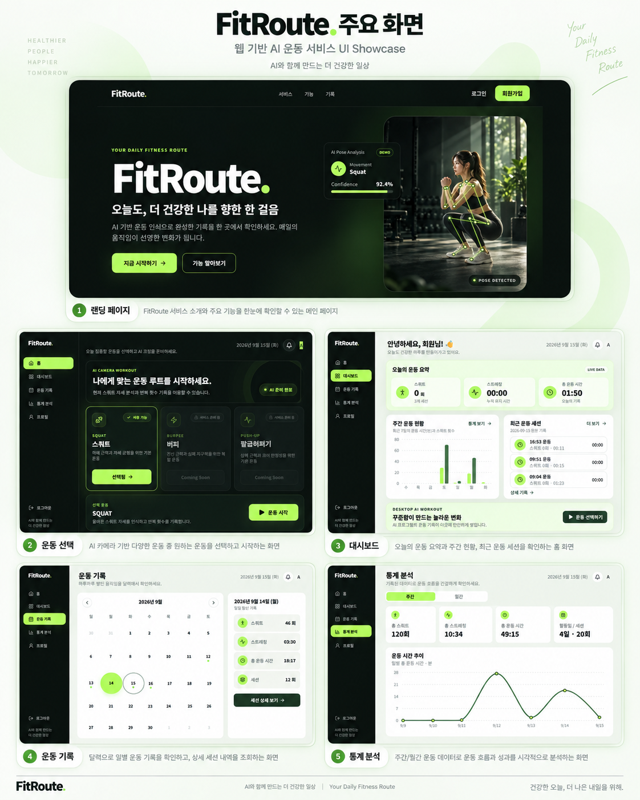
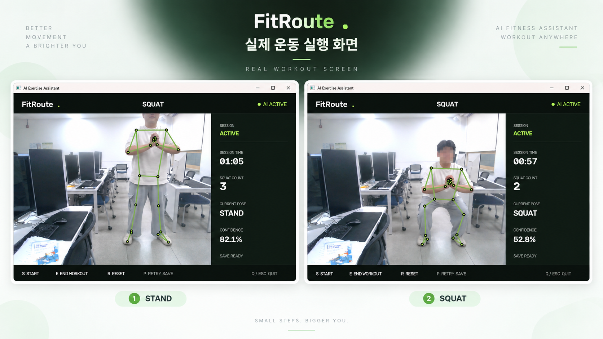
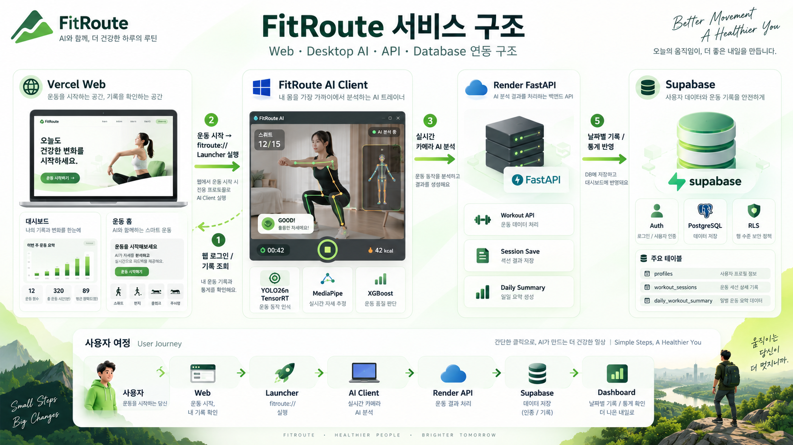
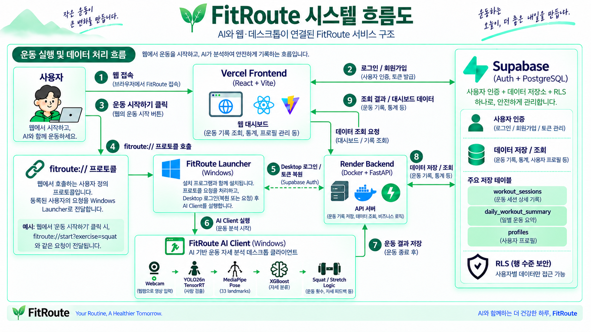
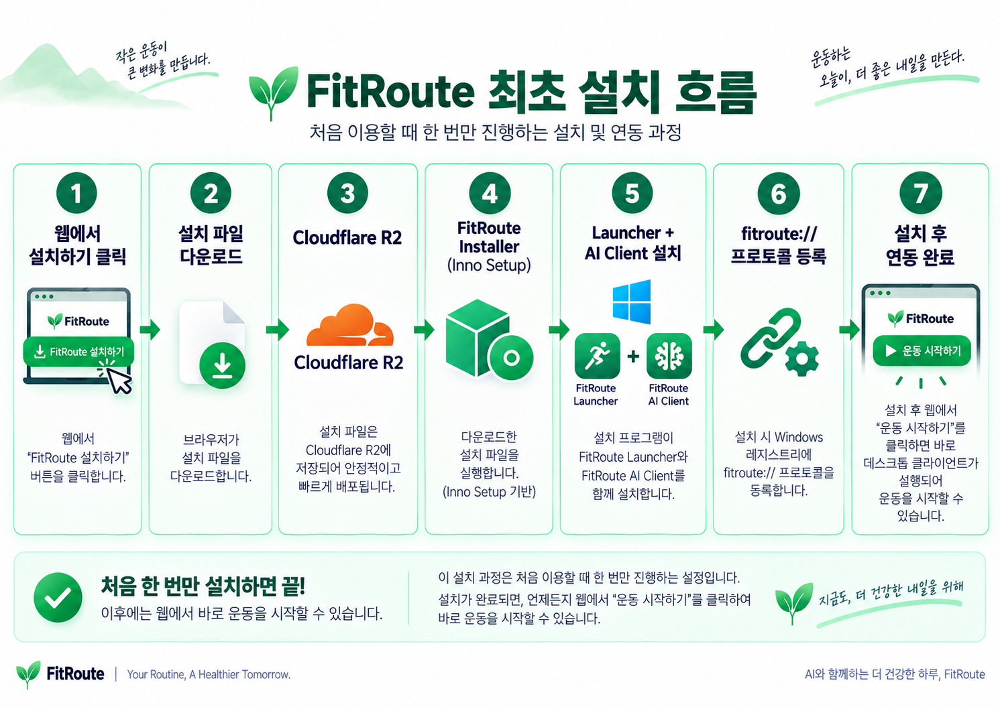

<div align="center">

# FitRoute

### AI 기반 실시간 운동 자세 분석 · 운동 기록 관리 서비스

웹에서 운동을 시작하면 Windows AI Client가 실행되어 실시간 자세를 분석하고,  
운동 결과를 Backend와 Supabase에 저장해 대시보드·운동 기록·통계로 연결합니다.

**개인 프로젝트 · Full-stack / AI / Desktop / Deployment**

[Production](https://fitroute-ivory.vercel.app) · `React + Vite` · `FastAPI` · `Supabase` · `YOLO26n TensorRT` · `MediaPipe` · `XGBoost`

</div>

---

## 1. 프로젝트 요약

FitRoute는 **웹 서비스와 Windows 기반 AI 운동 클라이언트를 하나의 사용자 흐름으로 연결한 운동 기록 서비스**입니다.

사용자는 웹에서 로그인한 뒤 운동을 시작할 수 있고, `fitroute://` Custom URI Scheme을 통해 Windows Launcher와 AI Client가 실행됩니다. AI Client는 Webcam 영상을 실시간 분석해 자세를 분류하고 스쿼트 반복 횟수와 스트레칭 시간을 기록합니다. 운동 종료 후 결과는 Render FastAPI를 거쳐 Supabase에 저장되며, 웹에서 일별 기록과 통계를 다시 확인할 수 있습니다.

| 영역 | 구현 내용 |
| --- | --- |
| Web | 로그인, 운동 선택, 대시보드, 운동 기록, 통계, 프로필 |
| Desktop AI | Webcam 기반 실시간 자세 분석, 스쿼트 카운트, 스트레칭 시간 측정 |
| Backend | 운동 결과 저장, 기록/통계 조회 API, 비즈니스 로직 |
| Data/Auth | Supabase Auth, PostgreSQL, 사용자별 데이터 접근을 위한 RLS 구조 |
| Distribution | Windows Installer, Custom URI Scheme, Cloudflare R2 배포 |
| Release | Prepare → E2E Test → Promote → Rollback 가능한 버전별 배포 workflow |

---

## 2. 프로젝트 개요

| 항 목 | 내 용 |
| --- | --- |
| **문 제** | 자세 인식 모델만으로는 사용자가 직접 설치·실행하고 운동 결과를 저장·조회하는 완결된 서비스 경험을 제공하기 어려움 |
| **목 표** | 실시간 자세 분석 → 운동 기록 → 서버 저장 → 대시보드 조회까지 하나의 End-to-End 서비스 흐름으로 연결 |
| **기 간** | 2026.09.04 ~ 2026.09.16 (약 2주) |
| **역 할** | 개인 프로젝트 — 기획 · AI · Web/API · Desktop · 배포 전 과정 구현 |

### Tech Stack

| 영역 | 기술 |
| --- | --- |
| **Languages** | Python, JavaScript / TypeScript |
| **Frontend** | React, Vite |
| **Backend / API** | FastAPI |
| **AI / Computer Vision** | OpenCV, Ultralytics YOLO26n, TensorRT, MediaPipe PoseLandmarker, XGBoost |
| **Database / Auth** | Supabase Auth, PostgreSQL, RLS |
| **Desktop Integration** | Windows Custom URI Scheme, Windows Credential Manager |
| **Packaging** | PyInstaller, Inno Setup |
| **Infrastructure / Deployment** | Docker, Vercel, Render, Cloudflare R2 |
| **Release Automation** | PowerShell, rclone, Vercel CLI |

---

## 3. 실제 구현 화면

### Web Service

랜딩 페이지부터 운동 선택, 대시보드, 운동 기록, 통계 분석까지 실제 구현한 주요 화면입니다.

<p align="center">
  
</p>

### Real-time AI Workout

실제 Webcam 입력에서 Pose를 추정하고, 현재 자세와 Confidence를 표시하며 스쿼트 반복 횟수를 기록합니다.

<p align="center">
  
</p>

---

## 4. 핵심 기능

### 실시간 AI 운동 분석

- Webcam 영상에서 YOLO26n으로 사람 영역을 탐지
- Person BBox에 **30% padding**을 적용한 ROI를 Pose 입력으로 사용
- MediaPipe PoseLandmarker로 **33개 landmark** 추출
- landmark를 **132개 feature**로 변환
- XGBoost 기반 자세 분류
- 현재 자세와 Confidence 실시간 표시
- 내부 자세 분류 결과를 운동 로직에 연결

현재 사용자 기능은 다음 두 가지에 집중했습니다.

- **Squat**: `Stand → Squat → Stand` 완료 시 1회로 기록
- **Stretch**: Stretch 상태 유지 시간을 누적 기록

> XGBoost 분류기는 `squat`, `run`, `sit`, `stretch`, `walk`, `jump`, `bendover`, `stand`, `lying`의 **9개 자세 class**를 내부적으로 분류합니다. 현재 서비스 기능은 이 중 `stand`, `squat`, `stretch`를 중심으로 Squat / Stretch 운동 로직에 연결했습니다.

### 운동 세션 기록

- 운동 세션 시작/종료
- 총 운동 시간 저장
- 스쿼트 횟수 저장
- 스트레칭 누적 시간 저장
- 운동 종료 후 Backend API를 통해 저장
- 저장 실패 시 pending/retry 흐름 지원

### 웹 기록 및 통계

- 오늘의 운동 요약
- 최근 운동 세션 조회
- 날짜별 운동 기록
- 주간/월간 운동 통계
- 프로필 관리

---

## 5. 서비스 구조

FitRoute는 **Web / Desktop AI / API / Database**를 분리하고, 각 역할을 독립적으로 구성했습니다.

<p align="center">
  
</p>

### 주요 구성

| Component | Role |
| --- | --- |
| Vercel Frontend | React + Vite 기반 웹 UI |
| FitRoute Launcher | `fitroute://` 요청 처리, Desktop 인증, AI Client 실행 |
| FitRoute AI Client | 실시간 Webcam inference 및 운동 로직 |
| Render Backend | FastAPI 기반 운동 저장/조회 API |
| Supabase | Auth + PostgreSQL + RLS |
| Cloudflare R2 | Windows Installer 배포 |

---

## 6. 실제 Runtime 흐름

<p align="center">
  
</p>

### 인증 및 운동 실행

```text
사용자
  ↓
Vercel Frontend
  ↔ Supabase Auth
  ↓ 운동 시작
fitroute://
  ↓
FitRoute Launcher
  ↔ Supabase Auth (Desktop 로그인 / 토큰 복원)
  ↓
FitRoute AI Client
```

### 운동 결과 저장

```text
AI Client
  ↓ POST /api/workouts
Render Backend
  ↔ Supabase PostgreSQL
```

### 대시보드 조회

```text
Frontend
  ↓ 조회 요청
Render Backend
  ↔ Supabase
  ↓
Frontend
```

Frontend가 운동 기록을 Supabase에서 직접 조회하지 않고, **Backend API를 통해 조회 및 응답받도록 역할을 분리**했습니다.

---

## 7. AI Pipeline

```text
Webcam
  ↓
YOLO26n TensorRT
(Person Detection)
  ↓
Person ROI (+30% padding)
  ↓
MediaPipe PoseLandmarker
(33 landmarks)
  ↓
132 Features
  ↓
XGBoost Classifier
  ↓
Temporal Smoothing
  ↓
Squat / Stretch Logic
  ↓
Workout Summary
```

### 설계 포인트

**YOLO26n TensorRT**  
사람 영역을 먼저 탐지해 Pose 분석 영역을 제한하고 Windows NVIDIA 환경에서 실시간 inference에 적합하도록 TensorRT engine을 사용했습니다.

**MediaPipe PoseLandmarker**  
33개 landmark의 좌표 정보를 추출해 자세 분류의 입력 feature로 사용했습니다.

**XGBoost**  
landmark 기반 feature를 입력받아 자세 class를 분류합니다. 영상 frame 단위 예측의 흔들림을 줄이기 위해 smoothing을 적용한 뒤 실제 운동 로직과 연결했습니다.

**Rule-based Exercise Logic**  
모델의 class 결과 자체를 운동 횟수로 사용하지 않고, 상태 전이를 기준으로 반복 동작을 기록하도록 분리했습니다.

### Pose Classification 범위

| Type | Details |
| --- | --- |
| Deep Learning / Vision | YOLO26n TensorRT 기반 Person Detection, MediaPipe PoseLandmarker 기반 Pose 추정 |
| Machine Learning | 132차원 landmark feature를 입력으로 사용하는 XGBoost 9-class classifier |
| Rule-based Logic | stable pose의 상태 전이를 이용한 Squat count / Stretch duration 계산 |

분류 대상 9개 class: `squat`, `run`, `sit`, `stretch`, `walk`, `jump`, `bendover`, `stand`, `lying`

### Runtime Performance

최종 패키징 AI Client의 실제 Webcam 환경 측정 결과입니다.

- End-to-End: **15.84 FPS**
- AI Inference: **21.20 FPS**
- 평균 Inference Latency: **47.18 ms**

End-to-End FPS는 Camera 입력, AI inference, 운동 로직, 화면 렌더링 등 실제 Client 전체 처리 흐름을 포함한 값이며, Inference FPS는 YOLO26n → MediaPipe → XGBoost AI pipeline 처리 기준 값입니다.

최종 패키징 및 bundle 최적화 이후에도 실제 Webcam 기반 운동 분석이 안정적으로 동작하는 처리 성능을 확인했습니다.

---

## 8. Windows Desktop 연동

웹에서 `운동 시작` 버튼을 클릭하면 다음 Custom URI 요청이 발생합니다.

```text
fitroute://start?exercise=squat
```

Windows에 등록된 FitRoute Launcher가 요청을 받아 안전하게 AI Client를 실행합니다.

### Launcher에서 처리하는 역할

- 허용된 command / exercise 값만 처리하는 whitelist 적용
- Desktop 로그인 또는 refresh token 복원
- Access token을 URL이나 command-line argument에 노출하지 않음
- Access token은 child process environment를 통해 AI Client에 전달
- Refresh token은 Windows Generic Credential에 저장
- 중복 카메라 실행 방지를 위한 mutex 적용

이 구조를 통해 **브라우저 → Windows Desktop AI** 연결을 별도의 수동 실행 없이 구성했습니다.

### Security 설계

- URI의 command / exercise 값을 whitelist로 제한
- child process 실행 시 `shell=False` 사용
- 사용자 password는 저장하지 않음
- refresh token만 Windows Credential Manager에 저장
- access token은 URL / argv / config / log에 기록하지 않고 child environment로만 전달
- Frontend / Launcher / 일반 API 요청에 Supabase service-role key를 사용하지 않음

---

## 9. 실행 환경 및 플랫폼 범위

| 영역 | 현재 지원 범위 |
| --- | --- |
| Web | Desktop / Mobile 브라우저에서 로그인, 대시보드, 기록, 통계 조회 |
| AI Workout | Windows Desktop Client |
| GPU Inference | NVIDIA GPU + 호환 Driver 기반 TensorRT runtime |
| 사용자 PC Python 환경 | 별도 Python / Conda / pip 설치 불필요 |
| Mobile AI Runtime | 현재 미지원 — 별도 native/mobile inference backend 필요 |

Installer에 Python runtime과 주요 dependency 및 모델을 함께 포함해 사용자 PC의 기존 Python 환경을 변경하지 않습니다.

---

## 10. 최초 설치 흐름

최초 한 번만 Windows Installer를 설치하면 이후에는 웹에서 바로 운동을 시작할 수 있습니다.

<p align="center">
  
</p>

```text
Web 설치하기
  ↓
Cloudflare R2 Installer 다운로드
  ↓
Inno Setup Installer
  ↓
Launcher + AI Client 설치
  ↓
fitroute:// Registry 등록
  ↓
설치 완료
```

Installer는 사용자 단위로 설치되며, 사용자 PC에는 Python/Conda 개발 환경이 필요하지 않습니다.

---

## 11. Packaging & Distribution

AI Client는 PyInstaller `onedir` 방식으로 패키징했습니다.

초기 bundle은 약 **6.79 GiB**였으며, runtime dependency를 분석해 실제 inference에 필요하지 않은 항목을 제거했습니다.

| 단계 | 결과 |
| --- | ---: |
| 초기 AI Client bundle | 약 6.79 GiB |
| 최종 AI Client bundle | 약 4.85 GiB |
| Bundle 감소 | 약 28.7% |
| 최종 Installer | 2.216 GiB |

주요 최적화:

- TensorRT builder 전용 resource 제거
- Polars runtime 제거
- `torch/bin/protoc.exe` 제거
- CUDA / Torch / TensorRT runtime module trace를 통해 추가 제거 가능성 검증

단순히 파일 크기를 줄이는 것보다 **실제 Camera → TensorRT → MediaPipe → XGBoost runtime이 유지되는지 검증하면서 최적화**했습니다.

---

## 12. Release Engineering

v0.1.1부터 Windows 배포 과정을 자동화했습니다.

```text
Prepare
  ↓
Installer Build
  ↓
SHA-256 / Size Verification
  ↓
R2 Immutable Upload
  ↓
Release Metadata
  ↓
Separate Windows PC E2E Test
  ↓
Promote
  ↓
Vercel Production Deploy
  ↓
Production HTTP Verification
```

### Release 원칙

- `SemVer` 기반 version 관리
- R2 object를 버전별 경로에 저장
- 동일 version overwrite 금지 (`--immutable`)
- Production 반영 전 별도 Windows PC E2E 수행
- Promote는 명시적인 승인 후에만 실행
- 이전 version metadata와 R2 object가 남아 있으면 동일 Promote 절차로 rollback 가능
- 성공한 deploy와 HTTP 검증 이후에만 `production.json` 갱신

R2 object 예시:

```text
releases/v0.1.1/FitRoute-AI-Client-Setup-0.1.1.exe
```

---

## 13. 문제 해결 경험

### 1) Windows AI bundle 과대화

**문제**  
PyInstaller 결과물이 약 6.79 GiB까지 증가했습니다.

**접근**  
Torch / CUDA / TensorRT / Polars 등의 파일을 크기와 runtime load 여부 기준으로 분리 분석했습니다.

**결과**  
Camera inference가 정상 동작하는 범위에서 약 4.85 GiB까지 축소했고, 더 작은 native runtime을 위해서는 Ultralytics/Torch 의존성 자체를 줄여야 한다고 판단해 무리한 삭제를 중단했습니다.

### 2) 브라우저와 Desktop AI 연결

**문제**  
웹에서 Windows AI 프로그램을 자연스럽게 실행해야 했습니다.

**해결**  
Custom URI Scheme `fitroute://` + Launcher를 설계하고, 인증과 AI Client 실행 책임을 Launcher에 분리했습니다.

### 3) 대용량 Installer 배포

**문제**  
2 GiB가 넘는 Installer를 일반적인 GitHub Release 단일 파일로 관리하기 어려웠습니다.

**해결**  
Cloudflare R2를 binary distribution storage로 분리하고 Vercel은 public download URL만 참조하도록 구성했습니다.

### 4) Vercel CLI가 저장소 전체를 배포 대상으로 인식

**문제**  
Production CLI deploy 과정에서 AI runtime과 Installer까지 포함해 수 GB를 업로드하려는 문제가 발생했습니다.

**해결**  
Vercel native process의 Working Directory를 `frontend`로 고정하고 root `.vercelignore`를 allowlist 방식으로 구성했습니다.

**검증**

```text
Deployment manifest: 51 files / 325,900 bytes
frontend 외부 파일: 0
AI / Installer artifact: 0
```

### 5) Vercel CLI stderr와 PowerShell 오류 처리

Vercel CLI의 정상적인 stderr 배너가 Windows PowerShell에서 `NativeCommandError`로 처리되는 문제를 확인했습니다.

`System.Diagnostics.Process` 기반 helper를 구현해 `StdOut`, `StdErr`, `ExitCode`를 분리하고 **ExitCode == 0**을 성공 기준으로 사용하도록 개선했습니다.

---

## 14. 검증 결과

현재 확인된 주요 검증 결과입니다.

- Windows Installer build 성공
- 별도 Windows PC 설치/실행 E2E 성공
- `fitroute://` → Launcher → AI Client 실행 성공
- Webcam / TensorRT / MediaPipe / XGBoost runtime 성공
- Render Backend 운동 결과 저장 성공
- Supabase 반영 성공
- Web Dashboard 기록 조회 성공
- Windows uninstall 및 protocol/credential 정리 확인
- Python test suite **122 passed**
- 최종 AI Client 실측 성능: **15.84 FPS End-to-End / 21.20 FPS Inference**
- Production deploy 성공
- Production HTTP **200** 확인

---

## 15. Version History

| Version | 내용 |
| --- | --- |
| `v0.1.0` | Windows Launcher + AI Client 초기 Production 배포 |
| `v0.1.1` | Prepare / Promote / Rollback 기반 Windows Release workflow 정식화, R2 versioned distribution 및 Vercel Production 배포 안정화 |

### v0.1.1 Release

- Release date: **2026-09-15**
- Installer: `FitRoute-AI-Client-Setup-0.1.1.exe`
- Size: **2,379,641,099 bytes (2.216213 GiB)**
- SHA-256:

```text
748E721160116539DA8ABADCA329C43BFAAE8A52E06AFB3FEB458554D6E2D0DD
```

---

## 16. Known Issue

### 최초 실행 후 첫 운동 저장 실패 가능성

별도 Windows PC E2E 테스트에서 **설치 후 최초 실행의 첫 번째 운동 세션 저장이 정상 처리되지 않는 현상**이 관찰되었습니다.

확인된 특징:

- Installer / Launcher / AI Client 실행 정상
- Desktop 인증 정상
- Camera 및 AI inference 정상
- 재시도 또는 이후 세션의 저장 정상
- 이후 Render → Supabase 저장 및 Dashboard 조회 정상

현재 원인은 확정하지 않았으며 다음 항목을 우선 확인할 예정입니다.

1. Render Backend 최초 요청의 cold start / 초기 응답 지연
2. Desktop 인증 및 access token 준비 timing
3. 최초 HTTP connection 초기화
4. `--auto-start-session`의 최초 session initialization timing

이 문제는 해결된 것으로 표시하지 않고 후속 patch version에서 재현 및 분석할 예정입니다.

---

## 17. 주요 데이터 구조

| Table | Role |
| --- | --- |
| `profiles` | 사용자 프로필 정보 |
| `workout_sessions` | 개별 운동 세션 상세 기록 |
| `daily_workout_summary` | 날짜별 운동 요약 및 통계 |

Supabase Auth와 PostgreSQL을 사용하며, RLS를 통해 사용자별 데이터 접근 범위를 분리합니다. Frontend의 운동 기록/통계 조회는 Backend API를 통해 처리합니다.

---

## 18. Repository Structure

```text
AI-Exercise-Assistant/
├─ frontend/                 # React + Vite Web application
├─ backend/                  # FastAPI API, Supabase integration, SQL, tests
├─ src/                      # AI Client runtime source
├─ desktop_launcher/         # Windows Launcher and Desktop Auth
├─ packaging/ai_client/      # PyInstaller specs, build and analysis tools
├─ installer/                # Inno Setup definition and input validation
├─ models/                   # Detector, pose and classifier assets
├─ config/                   # AI runtime settings
├─ scripts/                  # Environment and Windows release automation
├─ tests/                    # AI Client and Launcher test suite
├─ releases/windows/         # Version metadata and current Production state
├─ data/workout_logs/        # Local runtime output placeholder
├─ docs/                     # Architecture, deployment and engineering records
├─ requirements.txt          # AI development dependencies
├─ .vercelignore             # Vercel frontend-only deployment allowlist
└─ README.md
```

---

## 19. 개발 환경에서 실행

포트폴리오 README에서는 최소 실행 경로만 제공합니다. 모델 준비, TensorRT export, Launcher build, Installer 제작은 아래 상세 문서를 참고하세요.

### Backend

```powershell
docker build -f backend/Dockerfile -t fitroute-backend .
docker run --rm --env-file backend/.env -e PORT=8000 -p 8001:8000 fitroute-backend
```

### Frontend

```powershell
cd frontend
npm install
npm run dev
```

### AI Client (개발 환경)

```powershell
python src/main.py
```

> AI Client 로컬 실행에는 프로젝트에서 검증한 모델 파일과 NVIDIA/TensorRT 호환 환경이 필요합니다. 일반 사용자는 Windows Installer를 통해 실행하므로 별도 Python 개발 환경이 필요하지 않습니다.

---

## 20. 관련 기술 문서

포트폴리오 README에서는 핵심 내용만 요약하고, 세부 검증/설계 내용은 문서로 분리했습니다.

- [Windows Release Process](docs/windows_release_process.md)
- [Windows Installer](docs/windows_installer.md)
- [Desktop Launcher](docs/desktop_client_launcher.md)
- [AI Client Packaging Plan](docs/ai_client_packaging_plan.md)
- [Bundle Size Analysis](docs/ai_client_bundle_size_analysis.md)
- [Torch Slimming Analysis](docs/ai_client_torch_slimming_analysis.md)
- [Runtime Module Trace](docs/runtime_module_trace.md)
- [Production Deployment Checklist](docs/production_deployment_checklist.md)
- [Render Backend Deployment](docs/render_backend_staging.md)
- [Vercel Frontend Deployment](docs/vercel_frontend_staging.md)
- [Backend Guide](backend/README.md)
- [Frontend Guide](frontend/README.md)
- [Desktop Launcher Guide](desktop_launcher/README.md)
- [Docs Index](docs/README.md)

---

## 21. 프로젝트에서 보여주고자 한 역량

FitRoute는 단순한 자세 분류 모델 구현에서 끝내지 않고 다음 범위까지 직접 연결한 프로젝트입니다.

- Computer Vision / Pose / ML 모델을 실제 서비스 기능으로 연결
- Web과 Windows Desktop application 간 연동
- 인증과 사용자별 데이터 저장 구조 설계
- FastAPI 기반 API와 Frontend 데이터 흐름 구현
- AI runtime 패키징 및 Windows Installer 제작
- 대용량 binary distribution 구조 설계
- Production 배포 및 E2E 검증
- versioned release / promote와 metadata 기반 rollback workflow 자동화
- 문제 발생 시 로그와 runtime trace를 기반으로 원인을 분리하고 개선

**모델 정확도만 보는 프로젝트가 아니라, 사용자가 설치하고 실행하고 기록을 다시 확인할 수 있는 End-to-End AI 서비스 구현을 목표로 했습니다.**

---

<div align="center">

### FitRoute

**작은 운동이 큰 변화를 만듭니다.**  
AI와 함께 만드는 더 건강한 일상

</div>
