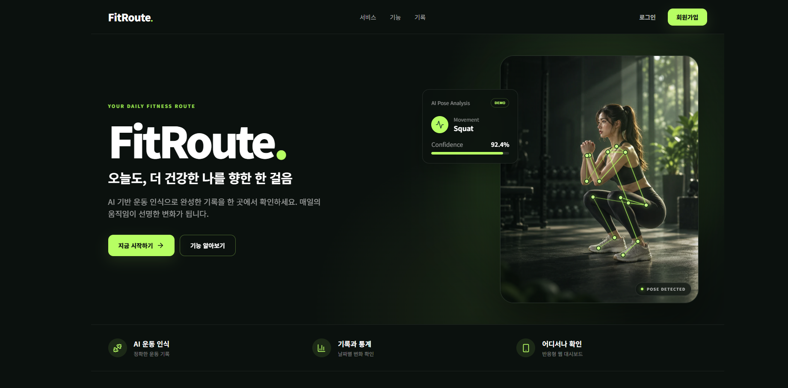
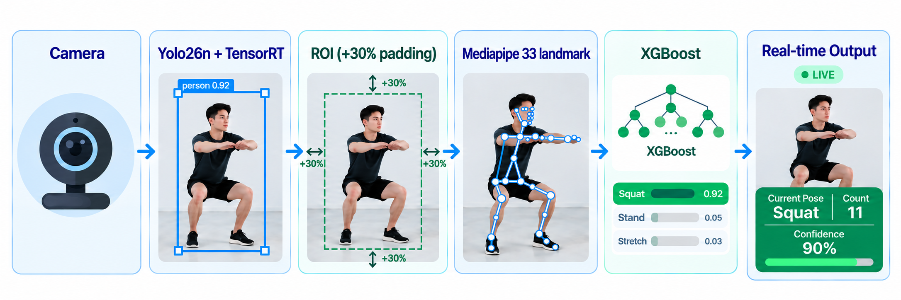

<div align="center">

# FitRoute

### AI 기반 실시간 운동 자세 분석 · 운동 기록 관리 웹 서비스

AI Client가 실시간 자세를 분석하고, 운동 결과를 DB에 저장해 대시보드·운동 기록·통계 기능을 제공하는 서비스입니다.

**개인 프로젝트 · Full-stack / AI / Desktop / Deployment**

[Demo](https://fitroute-ivory.vercel.app) · `React + Vite` · `FastAPI` · `Supabase` · `YOLO26n` · `TensorRT` · `MediaPipe` · `XGBoost`

<br />



</div>

---

## 1. 프로젝트 개요

FitRoute는 **AI 운동 클라이언트와 웹 서비스를 하나의 사용자 흐름으로 연결한 운동 기록 서비스**입니다.

AI Client는 Webcam 영상을 실시간 분석해 자세를 분류하고 스쿼트 반복 횟수와 스트레칭 시간을 기록합니다. 운동 종료 후 결과는 Render FastAPI를 거쳐 Supabase PostgreSQL에 저장되며, 사용자는 웹에서 일별 기록과 통계를 다시 확인할 수 있습니다.

| 항목 | 내용 |
| --- | --- |
| **문제** | 자세 인식 모델만으로는 사용자가 직접 설치·실행하고 운동 결과를 저장·조회하는 완결된 서비스 경험을 제공하기 어려움 |
| **목표** | 실시간 자세 분석 → 운동 기록 → 서버 저장 → 대시보드 조회까지 하나의 End-to-End 서비스 흐름으로 연결 |
| **기간** | 2026.09.04 ~ 2026.09.16 (약 2주) |
| **역할** | 개인 프로젝트 — 기획 · AI · Web/API · Desktop · 배포 전 과정 구현 |

### Tech Stack

| 영역 | 기술 |
| --- | --- |
| **Languages** | Python, JavaScript / TypeScript |
| **Frontend** | React, Vite |
| **Backend / API** | FastAPI |
| **AI / Computer Vision** | OpenCV, Ultralytics YOLO26n, MediaPipe PoseLandmarker, XGBoost |
| **Inference Acceleration** | TensorRT |
| **Database / Auth** | Supabase Auth, PostgreSQL, RLS |
| **Desktop Integration** | Windows Custom URI Scheme, Windows Credential Manager |
| **Containerization** | Docker |
| **Packaging** | PyInstaller, Inno Setup |
| **Cloud / Deployment** | Vercel, Render, Cloudflare R2 |

### 실행 환경 및 지원 범위

| 영역 | 현재 지원 범위 |
| --- | --- |
| Web | Desktop / Mobile 브라우저에서 로그인, 대시보드, 기록, 통계 조회 |
| AI Workout | Windows Desktop Client |
| GPU Inference | NVIDIA GPU + 호환 Driver 기반 TensorRT runtime |
| Mobile AI Runtime | 현재 미지원 — 별도 native/mobile inference backend 필요 |

Windows Installer에는 Python runtime과 주요 dependency 및 모델이 포함되어 있어 사용자 PC의 기존 Python 환경을 변경하지 않습니다.


---

## 2. 서비스 구조

FitRoute는 **Web / Windows Client / API / Database**를 분리하고, 각 역할을 독립적으로 구성했습니다.

<p align="center">
  
</p>

| Component | Role |
| --- | --- |
| Vercel Frontend | React + Vite 기반 웹 UI |
| FitRoute Launcher | 웹 요청 처리, 인증 상태 확인, AI Client 실행 |
| FitRoute AI Client | 실시간 Webcam inference 및 운동 로직 |
| Render Backend | FastAPI 기반 운동 저장/조회 API |
| Supabase | Auth + PostgreSQL + RLS |
| Cloudflare R2 | Windows Installer 배포 |

운동 세션과 일별 요약 데이터는 Supabase PostgreSQL에 저장하며, 사용자별 데이터 접근은 RLS 기반으로 분리합니다.

---
## 3. 시스템 흐름도

<p align="center">
  
</p>

### 인증 및 운동 실행

```text
사용자
  ↓
Vercel Frontend
  ↔ Supabase Auth
  ↓ 운동 시작
fitroute://
  ↓
FitRoute Launcher
  ↔ Supabase Auth (Desktop 로그인 / 토큰 복원)
  ↓
FitRoute AI Client
```

### 운동 결과 저장 및 조회

```text
AI Client
  ↓ POST /api/workouts
Render Backend
  ↔ Supabase PostgreSQL

Frontend
  ↓ 조회 요청
Render Backend
  ↔ Supabase
  ↓
Frontend
```

Frontend가 운동 기록을 Supabase에서 직접 조회하지 않고, **Backend API를 통해 조회 및 응답받도록 역할을 분리**했습니다.

### Desktop 연동 및 인증

- Launcher는 허용된 허용된 명령어와 운동 종류만 실행되도록 제한
- 하위 프로그램 실행 시 shell=False를 사용해 불필요한 명령 해석을 방지
- 사용자 비밀번호는 저장하지 않음
- refresh token은 Windows 자격 증명 관리자에 저장에 저장
- access token은 URL / argv / config / log에 기록하지 않고 실행 중인 AI Client에만 전달에 전달
- 동시에 여러 카메라가 실행되지 않도록 중복 실행 방지 처리

---
## 4. 실제 구현 화면

### Web Service

<p align="center">
  
</p>

### Real-time AI Workout

Pose를 추정하고, 현재 자세와 Confidence를 표시하며 스쿼트 반복 횟수를 기록합니다.

<p align="center">
  
</p>

---
## 5. 핵심 기능

### 실시간 AI 운동 분석

<p align="center">
  
</p>

[[상세_파이프라인]](docs/AI_client_Pipeline.md)

### 운동 세션 기록

- 운동 세션 시작/종료
- 총 운동 시간, 스쿼트 횟수, 스트레칭 누적 시간 저장
- 운동 종료 후 Backend API를 통해 저장
- 저장 실패 시 pending/retry 흐름 지원

### 웹 기록 및 통계

- 오늘의 운동 요약
- 최근 운동 세션 조회
- 날짜별 운동 기록
- 주간/월간 운동 통계
- 프로필 관리

[[실시간 처리 성능]](docs/Runtime_Performance.md)

---
## 6. Build & Release Engineering

AI Client를 실제 사용자 환경에 전달하기 위해 **패키징·최적화·Installer 제작부터 버전별 배포·검증·DEMO 반영까지** 하나의 release workflow로 구성했습니다.

### Packaging & Optimization

AI Client는 PyInstaller `onedir` 방식으로 패키징했으며, 실제 inference runtime을 유지하면서 불필요한 의존성을 제거해 bundle 크기를 최적화했습니다.

| 단계 | 결과 |
| --- | ---: |
| 초기 AI Client bundle | 약 6.79 GiB |
| 최종 AI Client bundle | 약 4.85 GiB |
| Bundle 감소 | 약 28.7% |
| 최종 Installer | 2.216 GiB |

주요 최적화:

- TensorRT builder 전용 resource 제거
- Polars runtime 제거
- `torch/bin/protoc.exe` 제거
- CUDA / Torch / TensorRT runtime module trace를 통해 추가 제거 가능성 검증

최종 Installer는 Launcher, Frozen AI Client, 모델과 production config를 포함하며 Cloudflare R2를 통해 배포합니다.

---

### [Release Workflow](docs/Release_Workflow.md)

### Version History

| Version | 내용 |
| --- | --- |
| `v0.1.0` | Windows Launcher + AI Client 초기 Production 배포 |
| `v0.1.1` | Prepare / Promote / Rollback 기반 Windows Release workflow 정식화, R2 versioned distribution 및 Vercel Production 배포 안정화 |

### v0.1.1 Release

- Release date: **2026-09-15**
- Installer: `FitRoute-AI-Client-Setup-0.1.1.exe`
- Size: **2,379,641,099 bytes (2.216213 GiB)**
- SHA-256:

```text
748E721160116539DA8ABADCA329C43BFAAE8A52E06AFB3FEB458554D6E2D0DD
```
---

## 7. 검증 결과

### 기능 및 통합 검증

- `fitroute://`를 통한 Web → Launcher → AI Client 실행 확인
- Webcam 입력부터 TensorRT → MediaPipe → XGBoost까지 AI runtime 동작 확인
- 운동 종료 후 Render Backend → Supabase 저장 및 Web Dashboard 조회 흐름 확인
- 별도 Windows PC에서 Installer 다운로드 → 설치 → 실행 → 운동 기록 확인까지 E2E 테스트 수행
  - 최초 실행의 첫 세션 저장 이슈는 `Known Issues / Limitations`에 별도 기록

### 자동화 테스트

- Python test suite **122 tests passed**

### 배포 검증

- Windows Installer build 및 설치 확인
- Vercel Production 배포 후 HTTP **200** 응답 확인

---
## 8. Known Issues

### 최초 실행 후 첫 운동 저장 실패 가능성

별도 Windows PC E2E 테스트에서 **설치 후 최초 실행의 첫 번째 운동 세션 저장이 정상 처리되지 않는 현상**이 관찰되었습니다.

- Installer / Launcher / AI Client 실행 정상
- Desktop 인증 및 Camera / AI inference 정상
- 재시도 또는 이후 운동 세션 저장 정상
- 이후 Render → Supabase 저장 및 Dashboard 조회 정상

현재 원인은 확정하지 않았으며 Render cold start, Desktop 인증/access token 준비 시점, 최초 HTTP connection 초기화, `--auto-start-session`의 초기 session timing을 후속 분석 대상으로 두고 있습니다.

---
## 9. 문제 해결 경험

### 1) Windows AI bundle 과대화

**문제**  
PyInstaller 결과물이 약 6.79 GiB까지 증가했습니다.

**접근 및 해결**  
Torch / CUDA / TensorRT / Polars 등의 파일을 크기와 runtime load 여부 기준으로 분석하고, 실제 Camera inference가 유지되는 범위에서 약 4.85 GiB까지 축소했습니다.

### 2) 브라우저와 Desktop AI 연결

**문제**  
웹에서 Windows AI 프로그램을 자연스럽게 실행해야 했습니다.

**해결**  
Custom URI Scheme `fitroute://` + Launcher를 설계하고 인증과 AI Client 실행 책임을 Launcher에 분리했습니다.

### 3) 대용량 Installer 배포

**문제**  
2 GiB가 넘는 Installer를 일반적인 Git repository나 Frontend asset으로 관리하기 어려웠습니다.

**해결**  
Cloudflare R2를 binary distribution storage로 분리하고 Vercel은 public download URL만 참조하도록 구성했습니다.

### 4) Vercel 배포 범위 과대화

**문제**  
Production CLI deploy 과정에서 AI runtime과 Installer까지 포함해 수 GB를 업로드하려는 문제가 발생했습니다.

**해결**  
Vercel native process의 Working Directory를 `frontend`로 고정하고 root `.vercelignore`를 allowlist 방식으로 구성해 Frontend만 배포되도록 수정했습니다.

### 5) Vercel CLI stderr 처리

Vercel CLI의 정상 stderr 배너가 PowerShell에서 오류로 처리되는 문제를 확인하고, `System.Diagnostics.Process` 기반 helper에서 StdOut / StdErr / ExitCode를 분리해 **ExitCode == 0**을 성공 기준으로 사용하도록 개선했습니다.

---
## 10. Repository Structure

```text
AI-Exercise-Assistant/
├─ frontend/                 # React + Vite Web application
├─ backend/                  # FastAPI API, Supabase integration, SQL, tests
├─ src/                      # AI Client runtime source
├─ desktop_launcher/         # Windows Launcher and Desktop Auth
├─ packaging/ai_client/      # PyInstaller specs, build and analysis tools
├─ installer/                # Inno Setup definition and input validation
├─ models/                   # Detector, pose and classifier assets
├─ config/                   # AI runtime settings
├─ scripts/                  # Environment and Windows release automation
├─ tests/                    # AI Client and Launcher test suite
├─ releases/windows/         # Version metadata and current Production state
├─ data/workout_logs/        # Local runtime output placeholder
├─ docs/                     # Architecture, deployment and engineering records
├─ requirements.txt
├─ .vercelignore
└─ README.md
```

---
## 11. 관련 기술 문서

세부 설계·검증·배포 과정은 별도 문서로 분리했습니다.

- [Windows Release Process](docs/windows_release_process.md)
- [Windows Installer](docs/windows_installer.md)
- [Desktop Launcher](docs/desktop_client_launcher.md)
- [AI Client Packaging Plan](docs/ai_client_packaging_plan.md)
- [Bundle Size Analysis](docs/ai_client_bundle_size_analysis.md)
- [Torch Slimming Analysis](docs/ai_client_torch_slimming_analysis.md)
- [Runtime Module Trace](docs/runtime_module_trace.md)
- [Production Deployment Checklist](docs/production_deployment_checklist.md)
- [Backend Guide](backend/README.md)
- [Frontend Guide](frontend/README.md)
- [Docs Index](docs/README.md)

---
## 12. 프로젝트를 통해 얻은 경험

- AI 모델을 단독으로 실행하는 것에서 그치지 않고 **사용자가 실제로 설치·실행·기록 조회까지 할 수 있는 End-to-End AI 서비스**로 연결한 경험
- Computer Vision / Pose / ML을 실제 운동 기능과 상태 기반 로직으로 연결한 경험
- Web과 Windows Desktop application을 Custom URI Scheme으로 연동한 경험
- 인증·API·DB를 포함한 사용자별 데이터 흐름을 설계하고 Production 환경에 배포한 경험
- AI runtime을 독립 실행 파일과 Installer로 패키징하고, 대용량 dependency를 분석·최적화한 경험
- 별도 Windows PC E2E 검증과 versioned release / promote / rollback workflow를 구성한 경험
- 오류를 단순 수정하는 데서 끝내지 않고 로그, runtime trace, deployment manifest를 기준으로 원인을 분리해 해결한 경험

---
## 13. 향후 발전 방향

- **첫 운동 저장 안정화**: 최초 실행 시 첫 세션 저장 실패 현상을 재현하고 인증·HTTP connection·Backend cold start 구간을 분석
- **운동 종류 확장**: 현재 Squat / Stretch 중심의 기능을 추가 운동과 반복 동작 로직으로 확장
- **실시간 추론 최적화**: AI Pipeline latency와 실제 End-to-End 처리 시간을 기반으로 runtime 성능 개선
- **Desktop Client 경량화**: PyInstaller bundle 및 Torch / CUDA runtime dependency를 추가 분석해 Installer 크기 감소 검토
- **모바일 확장 검토**: 장기적으로 Android / iOS 환경에 맞는 별도 inference architecture 검토

---

<div align="center">

### FitRoute

**작은 운동이 큰 변화를 만듭니다.**  
AI와 함께 만드는 더 건강한 일상

</div>
