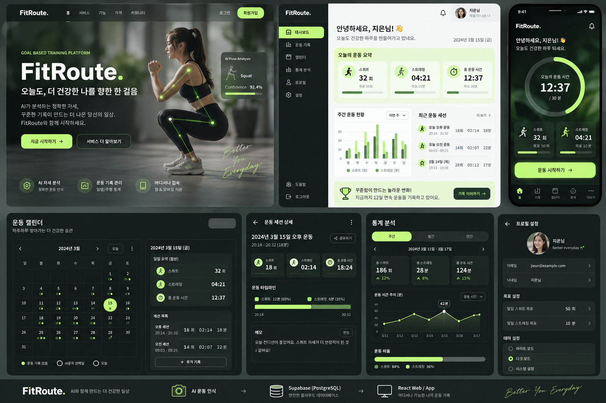

# FitRoute — AI Exercise Assistant



## Overview

FitRoute는 실시간 카메라 영상에서 사용자의 자세를 인식하고 운동 횟수·시간을 기록하는 AI 운동 보조 서비스입니다. Windows AI Client의 YOLO26n·MediaPipe·XGBoost 파이프라인과 React Web, FastAPI, Supabase를 하나의 사용자 흐름으로 연결했습니다.

| 영역 | 구현 내용 |
|---|---|
| AI Client | YOLO26n TensorRT/PyTorch, MediaPipe Pose, XGBoost, smoothing, 운동 상태 머신 |
| Web | React + TypeScript + Vite 기반 대시보드·운동 기록·통계·반응형 UI |
| API / Data | FastAPI, Supabase Auth, PostgreSQL, RLS, 일별 집계 |
| Desktop 연동 | `fitroute://` Launcher, Windows Credential Manager, 자동 세션 시작 |
| 배포 | Vercel Frontend, Render Backend, Cloudflare R2 Installer, Docker |

- Web: [https://fitroute-ivory.vercel.app](https://fitroute-ivory.vercel.app)
- API health: [https://fitroute-api.onrender.com/health](https://fitroute-api.onrender.com/health)
- 문서 인덱스: [docs/README.md](docs/README.md)

현재 Windows Installer는 개발 PC 검증에 이어 **별도 Windows PC에서 웹 다운로드 → 설치 → 실행 → 운동 기록 저장까지 E2E 검증을 완료**했습니다. 공개 Release용 code signing은 남아 있습니다.

## Current AI Pipeline

```text
Camera
  -> YOLO26n TensorRT / PyTorch (Person Detection)
  -> Person BBox
  -> MediaPipe Pose (33 Landmarks)
  -> 132 Features (x, y, z, visibility)
  -> XGBoost (9-Class Pose Classification)
  -> Raw pose prediction
  -> Consecutive-frame prediction smoothing
  -> Stable pose + confidence 표시
  -> Exercise State Machine
  -> Squat / Stretch
  -> Workout Session Timer
  -> Session Summary (Python dict)
  -> FastAPI POST /api/workouts (session end only)
  -> Supabase workout_sessions + daily_workout_summary
  -> React Dashboard / History / Statistics
```

TensorRT 엔진이 있으면 우선 사용하고, 없으면 PyTorch 모델로 fallback합니다.

## Supported Pose Classes

|  ID | Class    |
| --: | -------- |
|   0 | squat    |
|   1 | run      |
|   2 | sit      |
|   3 | stretch  |
|   4 | walk     |
|   5 | jump     |
|   6 | bendover |
|   7 | stand    |
|   8 | lying    |

## Exercise Rules

- Squat: `stand -> squat -> stand` 완료 시 1회
- Stretch: `stretch` 자세 유지 시간 측정

운동 카운터와 타이머는 stable pose 기반 상태 머신으로 구현되어 있습니다. Workout Session은 전체 경과시간과 세션 내 Squat 횟수 및 Stretch 시간을 관리합니다. 세션 종료 시 선택적으로 FastAPI를 통해 Supabase에 저장합니다.

## Setup

기존 Conda 환경을 활성화한 뒤 필요한 최소 패키지를 설치합니다. AI Client 의존성은 기존 모델 및 CUDA 환경과의 호환성을 유지하고, Docker에서 사용하는 Backend 의존성은 검증된 버전으로 고정합니다.

```bash
pip install -r requirements.txt
```

TensorRT export는 NVIDIA GPU, CUDA, TensorRT 및 현재 Ultralytics 버전과 호환되는 환경이 필요하며, export 과정에서 추가 패키지 설치가 요구될 수 있습니다.

## Models

다음 기존 파일은 사용자가 직접 복사해야 합니다. 애플리케이션은 이 파일들을 임의로 생성하거나 다운로드하지 않습니다.

```text
models/pose/pose_landmarker_full.task
models/classifier/model_weights.xgb
models/classifier/classes.json
```

`classes.json`은 학습 당시의 클래스 순서를 그대로 유지해야 합니다.

YOLO 파일 위치는 다음과 같습니다.

```text
models/detector/yolo26n.pt
models/detector/yolo26n.engine
models/detector/yolo26n.onnx
models/detector/yolo26n.fp16.onnx
```

TensorRT engine을 우선 사용하고 PyTorch 가중치로 fallback합니다. ONNX와 FP16 ONNX는 향후 배포 fallback 검토를 위해 보존합니다. `.engine` 파일은 생성 GPU/TensorRT 환경에 종속적이므로 Git에서 제외됩니다.

## Environment Check

```bash
python scripts/check_environment.py
```

Python과 주요 패키지 버전, CUDA/GPU 상태 및 모든 모델 파일의 존재 여부를 출력합니다.

## TensorRT Export

```bash
python scripts/export_yolo26n_tensorrt.py
```

정적 batch 1, image size 640, FP16 설정으로 export하며 최종 결과를 다음 위치에 둡니다.

```text
models/detector/yolo26n.engine
```

## Person Detection Test

```bash
python tests/test_person_detection.py
```

웹캠 화면에 사람 bounding box, confidence, FPS를 표시합니다. 처음 30프레임은 평균 benchmark에서 제외합니다. `Esc` 또는 `Q`로 종료합니다.

## Main

```bash
python src/main.py
```

현재 main은 각 YOLO 사람 bbox에 30% padding을 적용한 crop에서 33개 landmark를 추출하고, 132개 feature로 XGBoost 자세 분류를 수행합니다. 원본 bbox, landmark point, 자세 label과 confidence를 화면에 표시하며 `Esc` 또는 `Q`로 종료합니다.

Prediction smoothing은 일반 자세를 3프레임, 짧은 `jump`를 2프레임 연속 확인한 뒤 stable 자세로 확정합니다. 일시적인 pose 미검출은 3프레임까지 기존 stable 자세를 유지합니다. Tracking은 아직 사용하지 않으므로 화면에서 가장 큰 사람을 주 사용자로 선택합니다.

운동 판단에는 raw prediction이 아닌 stable pose만 사용합니다.

- `1`: Squat — `stand -> squat -> stand` 완료 시 1회
- `2`: Stretch — `stretch` 자세의 실제 경과 시간 누적
- `0`: Idle
- `R`: 현재 선택된 운동 기록만 초기화
- `S`: 새 Workout Session 시작 및 운동 기록 전체 초기화
- `E`: 진행 중인 Session 종료 및 terminal summary 출력
- `P`: 직전 저장 실패 Session의 API 업로드 재시도
- `Q` 또는 `Esc`: 종료

세션 시간은 운동 모드와 독립적이므로 Idle과 휴식 시간도 포함합니다. 세션이 진행 중일 때 `Q` 또는 `Esc`로 종료하면 현재 시각까지 자동으로 마감합니다. Summary는 향후 API 전송을 위해 다음 필드를 유지합니다.

```text
workout_date, started_at, ended_at, workout_seconds,
squat_count, stretch_seconds
```

## AI Client → FastAPI 자동 저장

AI 프로그램은 `FITROUTE_ACCESS_TOKEN`이 설정된 경우 `E`, `Q`, `Esc`로 세션을 종료하는 순간 summary를 `POST /api/workouts`에 한 번 전송합니다. 토큰과 비밀번호는 파일에 저장하지 않습니다.

8000 포트를 `vmnat`가 사용 중인 현재 개발 환경에서는 Backend를 8001로 실행합니다.

```cmd
uvicorn backend.app.main:app --reload --port 8001
```

새 터미널에서 로그인 토큰을 발급합니다.

```cmd
python backend/scripts/get_test_token.py
```

CMD:

```cmd
set FITROUTE_ACCESS_TOKEN=eyJ...
set FITROUTE_API_BASE_URL=http://127.0.0.1:8001
python src/main.py
```

PowerShell:

```powershell
$env:FITROUTE_ACCESS_TOKEN="eyJ..."
$env:FITROUTE_API_BASE_URL="http://127.0.0.1:8001"
python src/main.py
```

토큰이 없으면 `Cloud: DISABLED`로 표시되며 로컬 운동 인식은 그대로 동작합니다. 저장 성공 시 `Cloud: SAVED`와 Session ID를 표시합니다. 401, validation 오류, 서버 오류, timeout 또는 연결 실패 시 프로그램은 종료되지 않고 `Cloud: FAILED`와 함께 summary를 메모리에 유지합니다. Backend를 복구하거나 토큰을 갱신한 뒤 `P`를 누르면 같은 pending summary만 재시도합니다. 성공한 summary는 pending에서 제거되므로 `P`로 중복 저장되지 않습니다.

API Client 단위 테스트:

```cmd
pytest tests/test_api_client.py -v
```

Smoothing 로직만 검증하려면 다음 명령을 사용합니다.

```bash
python tests/test_prediction_smoothing.py
```

운동 상태 머신만 검증하려면 다음 명령을 사용합니다.

```bash
python tests/test_exercise_counter.py
```

Workout Session을 검증하려면 다음 명령을 사용합니다.

```bash
python tests/test_workout_session.py
```

30-frame warmup 후 30초 동안 전체 파이프라인의 단계별 성능을 측정하려면 다음 명령을 사용합니다.

```bash
python src/main.py --benchmark-seconds 30
```

## Web → Windows Desktop Launcher

Vercel의 운동 선택 화면에서 `fitroute://start?exercise=squat` custom protocol을 호출해 Windows Desktop Launcher를 열고, 독립형 Frozen AI Client를 실행할 수 있습니다.

```text
React /exercise
  → fitroute://start?exercise=squat
  → FitRouteLauncher.exe
  → Windows Credential Manager refresh 또는 Desktop Login
  → access token을 child environment로만 전달
  → FitRouteAIClient.exe --exercise squat --auto-start-session
  → Camera 준비 완료 후 Workout Session 자동 시작
```

Launcher는 URL의 command와 exercise를 whitelist로 검증하고 `subprocess.Popen([...], shell=False)`만 사용합니다. Password는 저장하지 않으며 refresh token만 Windows Credential Manager에 보관합니다. Access token은 URL, command line, config 또는 `.env`에 기록하지 않고 AI child process의 환경변수로만 전달합니다. Web과 Desktop은 같은 Supabase 계정으로 로그인해야 같은 Dashboard 기록을 확인할 수 있습니다.

개발 환경 빌드 예시:

```powershell
C:\path\to\vision_ai\python.exe -m pip install -r desktop_launcher\requirements.txt
C:\path\to\vision_ai\python.exe -m pip install pyinstaller
powershell -ExecutionPolicy Bypass -File .\desktop_launcher\build_launcher.ps1 `
  -PythonExecutable "C:\path\to\vision_ai\python.exe" `
  -ApiBaseUrl "https://fitroute-api.onrender.com" `
  -SupabaseUrl "https://YOUR_PROJECT.supabase.co" `
  -SupabaseAnonKey "YOUR_PUBLISHABLE_KEY"
```

생성물은 `desktop_launcher/dist/FitRouteLauncher.exe`와 같은 폴더의 `config.json`입니다. 기본 개발 build는 AI Client를 `..\..\dist\FitRouteAIClient\FitRouteAIClient.exe` 상대 경로로 참조합니다. 최종 설치 구조에서는 Launcher 옆 `ai_client\FitRouteAIClient.exe`를 사용합니다. 런타임 config에는 Python executable, Conda 환경, repository root나 `src/main.py` 경로가 없습니다. Supabase publishable key는 들어가지만 service role/secret key는 Launcher와 Frontend에 사용하면 안 됩니다.

Launcher 관련 테스트는 실제 Registry, Supabase Login, Credential 입력 또는 Webcam 실행 없이 수행합니다.

```powershell
python -m pytest tests/test_desktop_auth.py -q -p no:cacheprovider
python -m pytest tests/test_desktop_launcher.py tests/test_auto_start_session.py -q -p no:cacheprovider
```

5단계 검증에서 Launcher/Auth/auto-start/path/runtime diagnostic 관련 테스트 39개와 전체 root suite 85개가 통과했습니다. 재빌드한 onefile Launcher(63,476,752 bytes)는 `--help`와 `--dry-run`이 모두 exit 0이었고, 상대 경로가 실제 Frozen AI Client를 찾는 것도 확인했습니다. AI Client의 `--diagnose-runtime`도 PASS였으며 이 자동 검증에서는 Webcam을 실행하지 않았습니다. Protocol 등록/제거, Desktop 인증과 실제 E2E 절차는 [Desktop Launcher 개발 문서](docs/desktop_client_launcher.md)를 참고하세요.

### Windows AI Client bundle 최적화 현황

6-B 최적화는 완료되었습니다. 기존 성공 bundle을 보존하고 최적화 항목을 한 번에 하나씩 제외한 별도 candidate로 검증했으며, 최종 설치 대상 baseline은 `dist_candidate_protoc/FitRouteAIClient/`입니다.

| 단계 | Bundle 크기 | 이전 단계 대비 | Original 대비 |
|---|---:|---:|---:|
| Original | 6.794548 GiB | - | - |
| TensorRT Builder resource 8개 제거 | 5.020208 GiB | -1.774341 GiB | 약 -26.1% |
| Polars runtime 제거 | 4.849181 GiB | -0.171026 GiB | 약 -28.6% |
| `torch/bin/protoc.exe` 제거 (최종) | **4.846573 GiB** | -0.002608 GiB | **약 -28.67%** |

최종 크기는 **5,203,968,114 bytes / 4,962.890734 MiB / 4.846573 GiB**입니다. Original 대비 **2,091,622,330 bytes / 1.947975 GiB**를 절감했고 총 감소율은 **28.669679%**입니다. 최종 baseline에는 TensorRT inference runtime/plugin/parser와 Torch/CUDA runtime, OpenCV, MediaPipe, XGBoost 및 네 개 모델이 유지됩니다.

최종 baseline은 다음 실제 흐름을 통과했습니다.

- `--help`, 제한 PATH `--diagnose-runtime`
- Camera와 YOLO26n TensorRT inference
- MediaPipe pose, XGBoost classification, Squat count
- Web → Protocol → Launcher → Desktop Auth → Frozen AI Client
- Render API 저장, Supabase 반영, Web Dashboard 조회

`torch.testing` 전체 제거 실험은 PyTorch 2.11의 최상위 `torch/__init__.py`가 이를 직접 import하여 `import torch` 자체가 실패했으므로 최종 baseline에 합치지 않았습니다. 따라서 `torch.testing`은 **KEEP**입니다.

6-B-3C에서 75.609초 동안 실제 Camera/TensorRT inference 프로세스를 100ms 간격으로 추적해 전체 361개 모듈을 관찰했으며, Bundle native 331개 중 218개가 실제 로드되었습니다. 특히 CUDA 25/25, Torch native 12/12, TensorRT 4/4가 모두 로드되었고 MediaPipe 1/1, XGBoost 1/1과 `torch_cuda.dll`의 직접 PE dependency 11개도 전부 관찰되었습니다. `NOT_OBSERVED` 중 가장 큰 파일은 OpenCV FFmpeg DLL 약 29.446 MiB였으며, 우선 검토 기준인 50~100 MiB 이상의 대형 미관찰 native DLL은 없었습니다. 현재 Ultralytics + Torch 구조에서 추가 native 제거는 회귀 위험 대비 절감 효과가 작아 6-B 최적화를 여기서 종료합니다.

세부 수치는 [AI Client Bundle Size Analysis](docs/ai_client_bundle_size_analysis.md), [Torch Slimming Analysis](docs/ai_client_torch_slimming_analysis.md), [Runtime Module Trace](docs/runtime_module_trace.md)를 참고하세요. Direct TensorRT 전용 구조는 이번 최적화 범위가 아닌 별도 아키텍처 단계입니다.

### Windows Installer 및 Cloudflare R2 배포

최종 Windows Desktop Client는 PyInstaller onedir bundle을 Inno Setup으로 패키징한 `FitRoute-AI-Client-Setup-0.1.0.exe`로 배포합니다. Installer에는 Launcher, Frozen AI Client, production config와 모델이 모두 포함되며 결과물은 약 **2.2 GiB**입니다. `%LOCALAPPDATA%\Programs\FitRoute AI Client`에 관리자 권한 없이 per-user 방식으로 설치하고 다음 구조를 만듭니다.

```text
FitRoute AI Client/
├─ FitRouteLauncher.exe
├─ config.json
└─ ai_client/
   ├─ FitRouteAIClient.exe
   ├─ _internal/
   └─ models/
```

Installer는 `fitroute://` protocol을 현재 사용자 Registry에 등록합니다. 설치된 AI Client는 Python runtime과 주요 dependency를 bundle에 포함하므로 사용자 PC에 Python, Conda, pip, 별도 TensorRT 또는 CUDA Toolkit을 설치하거나 기존 Python 환경을 변경하지 않습니다. 실시간 추론에는 호환 NVIDIA GPU와 Driver가 필요합니다.

개발 PC에서 R2 다운로드 → 설치 → Web/Protocol/Launcher/Auth → Camera/AI → Render/Supabase/Dashboard 흐름과 제거까지 검증했습니다. 또한 **별도 Windows PC에서 웹 다운로드 → 설치 → 실행 → 저장까지 타 PC E2E 검증을 완료**했습니다. Uninstall 시 프로그램 파일과 `launcher.log`, protocol Registry 등록 및 Windows Credential Manager의 Desktop refresh credential이 제거됩니다.

Installer가 크기 때문에 Git repository나 Vercel 정적 asset에 포함하지 않고 Cloudflare R2 Object Storage에 별도로 업로드합니다. R2는 AI/API server가 아니라 versioned Windows binary를 보관하고 public HTTPS download를 처리하는 배포 계층입니다. Vercel Production에는 R2 public URL을 다음 환경변수로 주입합니다.

```dotenv
VITE_DESKTOP_CLIENT_DOWNLOAD_URL=https://<public-r2-host>/FitRoute-AI-Client-Setup-0.1.0.exe
```

Web의 설치 안내 버튼은 이 환경변수의 URL을 사용해 R2 Installer를 내려받습니다. 값이 없으면 Frontend는 URL을 임의로 만들지 않고 `다운로드 준비 중` 상태를 표시합니다. 공개 download URL과 달리 R2 Access Key, Secret Access Key, API token 및 업로드 도구 credential은 배포 작업에만 사용하며 README나 Frontend에 포함하지 않습니다.

```text
FitRoute Web (Vercel)
  → Windows 앱 설치
  → Cloudflare R2 public download
  → Inno Setup Installer
  → FitRouteLauncher.exe + ai_client/FitRouteAIClient.exe
  → fitroute:// 등록
  → Web에서 운동 시작
  → Desktop Auth → Camera / AI inference
```

### 모바일 브라우저 지원 및 제한사항

FitRoute의 React Frontend는 반응형 Web UI이므로 Desktop뿐 아니라 스마트폰과 Tablet 브라우저에서도 로그인, Dashboard, 운동 기록·통계 조회 및 Installer 안내 같은 Web 기능을 사용할 수 있습니다. 그러나 반응형 UI 지원과 실시간 AI 운동 분석의 모바일 실행 지원은 서로 다릅니다. YOLO, MediaPipe와 XGBoost는 현재 브라우저에서 실행되지 않으며 Web은 Windows Desktop AI Client를 여는 presentation/entry point 역할을 합니다.

| 구성 요소 | 현재 구현 | 모바일 브라우저 |
|---|---|---|
| React Web UI | Responsive React Web | 가능 |
| 로그인 | Supabase Auth | 가능 |
| Dashboard / 운동 기록·통계 | Web + FastAPI + Supabase | 가능 |
| Installer 다운로드 안내 | Web UI + R2 download URL | 가능 |
| Windows Installer 실행 | Inno Setup `.exe` | 불가 |
| `fitroute://` handler | Windows Registry + `FitRouteLauncher.exe` | 현재 불가 |
| Desktop AI Client | Windows PyInstaller application | 불가 |
| 실시간 Camera AI 분석 | Windows Desktop Client | 현재 불가 |
| YOLO inference | NVIDIA TensorRT FP16 `.engine` | 현재 구조로 불가 |

현재 `fitroute://` handler는 Windows Installer가 `HKCU\Software\Classes\fitroute`에 등록하는 `FitRouteLauncher.exe`이고 Android/iOS용 FitRoute native application은 없습니다. Inno Setup `.exe`, Windows PyInstaller binary와 Windows Credential Manager 기반 Desktop Auth도 Android, iOS 또는 iPadOS에서 그대로 실행할 수 없습니다. 또한 현재 YOLO26n TensorRT `.engine` backend는 NVIDIA GPU가 있는 Windows PC용이므로 모바일 플랫폼에는 별도의 inference backend가 필요합니다. 이는 모바일 앱 자체가 불가능하다는 뜻이 아닙니다.

향후 모바일 지원 시에는 별도 제품 단계에서 ONNX Runtime Mobile, TensorFlow Lite 또는 Core ML 같은 모바일 inference backend, Android/iOS MediaPipe Tasks와 native Camera pipeline을 검토해야 합니다. XGBoost classifier 역시 모바일 실행 방법이나 ONNX/TFLite 변환을 평가하고, 인증 정보는 Windows Credential Manager 대신 Android Keystore/iOS Keychain에 저장해야 합니다. 앱 진입도 Windows Registry protocol 대신 Android App Link 또는 iOS Universal Link/플랫폼 custom scheme으로 별도 구현해야 하며, 이 항목들은 현재 구현된 기능이 아닙니다.

Launcher는 `launcher.log`에 token 값 없이 lifecycle만 기록합니다. Access Token과 API URL은 child environment에만 전달하며 argv는 다음과 같습니다.

```text
FitRouteAIClient.exe --exercise squat --auto-start-session
```

### Launcher 개발 중 실패와 해결 기록

| 증상 | 확인된 원인 | 해결 |
|---|---|---|
| `attempt to collect multiple Qt bindings packages` | 범용 `vision_ai` 환경의 import graph가 PyQt5와 PyQt6를 함께 탐색 | PyQt 패키지는 제거하지 않고 PyInstaller에서 `PyQt5`, `PyQt6` 제외 |
| Launcher와 무관한 matplotlib runtime hook 포함 | `desktop_auth → httpx._main → rich → IPython → matplotlib` 선택 의존성 경로 | Launcher가 사용하지 않는 `matplotlib`을 제외해 `pyi_rth_mplconfig` 제거 |
| `_ctypes` import 시 DLL load 실패 | Conda Python의 `_ctypes.pyd`가 `Library\bin\ffi.dll`에 의존하지만 onefile bundle에서 누락 | `-PythonExecutable`로 Conda root를 계산하고 존재하는 `ffi-7.dll`, `ffi-8.dll`, `ffi.dll`을 모두 `--add-binary`로 포함 |
| `pyi_rth_pkgres` 실행 중 `pyexpat` DLL load 실패 | `pyexpat.pyd`의 직접 의존 파일인 `libexpat.dll` 누락 | `objdump`로 직접 의존성을 확인한 뒤 `libexpat.dll` 포함 |
| `_lzma`, `_bz2`, `_sqlite3`, `_tkinter`, `_zmq` DLL 경고 | Conda의 관련 `.pyd`가 `Library\bin`의 런타임 DLL을 사용하지만 PyInstaller가 자동 해석하지 못함 | 확인된 `liblzma.dll`, `LIBBZ2.dll`, `sqlite3.dll`, `tcl86t.dll`, `tk86t.dll`, `libzmq-mt-4_3_5.dll`만 조건부 포함 |
| Login UI의 `Label() got multiple values for keyword argument 'fg'` | `label()` helper의 기본 `fg`와 호출부의 override `fg`가 동시에 전달 | `bg`, `fg`를 `options.setdefault()`로 설정해 호출부 override 우선 적용 |

Conda DLL은 이름을 추측해 하나만 선택하지 않았습니다. 각 `.pyd`의 PE dependency와 `Library\bin`의 실제 파일을 확인한 뒤 존재하는 파일만 bundle에 추가했습니다. `ctypes/_ctypes`는 Credential Manager 구현이 사용하므로 제외하지 않습니다.

## Production 실행 및 Docker

로컬 Docker 검증과 내부 Staging Cloud 배포를 완료했습니다. Backend는 Render의 `https://fitroute-api.onrender.com`, Frontend는 Vercel의 `https://fitroute-ivory.vercel.app`에서 동작합니다. Backend는 `backend/start.py`를 통해 Provider가 전달하는 `PORT`를 읽고, `--reload` 없이 `0.0.0.0:$PORT`에서 실행됩니다.

Cloud 배포와 Windows runtime의 역할은 다음과 같이 분리됩니다.

| 구성 요소 | 배포 위치 | 역할 |
|---|---|---|
| React Frontend | Vercel | 반응형 Web UI, 인증 진입, Dashboard와 Desktop 설치/실행 안내 |
| FastAPI Backend | Render | 인증된 운동 기록 API |
| Auth / Database | Supabase | Supabase Auth, PostgreSQL, RLS 기반 사용자 데이터 분리 |
| Installer binary | Cloudflare R2 | 약 2.2 GiB Windows Installer 저장 및 HTTPS download |
| AI runtime | 사용자 Windows PC | Webcam, YOLO TensorRT, MediaPipe, XGBoost와 운동 상태 로직 |

```text
Browser → React / Vercel ───────→ Cloudflare R2 / Windows Installer
              │
              └→ FastAPI / Render → Supabase Auth + PostgreSQL

Windows Web → fitroute:// → Launcher → Desktop Auth → AI Client
                                                └→ Camera → YOLO TensorRT → MediaPipe → XGBoost
```

로컬 Docker 실행 구조는 다음과 같습니다.

```text
Windows Client
http://127.0.0.1:8001
        ↓
Docker Port Mapping
Windows 8001 → Container 8000
        ↓
Container FastAPI
0.0.0.0:8000
```

`0.0.0.0`은 Container가 요청을 받기 위한 listen 주소이며 브라우저에 입력하는 주소가 아닙니다.

Repository root에서 Backend 이미지를 빌드하고 실행합니다.

```powershell
docker build -f backend/Dockerfile -t fitroute-backend .
docker run --rm --env-file backend/.env -e PORT=8000 -p 8001:8000 fitroute-backend
```

실행 후 다음 주소로 확인합니다.

```text
http://127.0.0.1:8001/health
http://127.0.0.1:8001/docs
```

이 구성에서는 Frontend와 Python AI Client가 모두 Windows의 공개 포트 `8001`을 사용합니다.

```dotenv
# frontend/.env
VITE_API_BASE_URL=http://127.0.0.1:8001
```

```cmd
set FITROUTE_API_BASE_URL=http://127.0.0.1:8001
```

Docker를 사용하지 않고 FastAPI를 직접 실행할 때는 포트 매핑이 없습니다.

```powershell
uvicorn backend.app.main:app --reload --port 8001
```

Cloud Runtime에는 실제 `.env` 파일을 업로드하지 않고 다음 환경변수를 Provider 설정에 등록합니다.

```dotenv
ENVIRONMENT=production
SUPABASE_URL=https://YOUR_PROJECT.supabase.co
SUPABASE_ANON_KEY=YOUR_PUBLISHABLE_KEY
FRONTEND_ORIGINS=https://YOUR_FRONTEND_DOMAIN
LOG_LEVEL=info
```

`PORT`는 Cloud Provider가 전달하는 값을 사용합니다. `FRONTEND_ORIGINS`에는 trailing slash 없는 정확한 HTTPS Frontend Origin만 넣고 wildcard `*`는 사용하지 않습니다. Service role key, DB password, 사용자 Access Token은 Production 환경변수나 Frontend에 넣지 않습니다.

Frontend Production build는 다음과 같이 검증합니다.

```powershell
cd frontend
npm install
npm run lint
npm run build
npm run preview -- --host 127.0.0.1
```

Hosting Provider에는 `frontend/dist`를 배포하고, React Router 직접 접근이 `/index.html`로 fallback되도록 SPA rewrite를 설정해야 합니다. 실제 Frontend URL이 확정되면 Supabase Authentication의 Site URL과 Redirect URLs도 해당 HTTPS 주소로 변경합니다.

Docker Desktop + WSL2 환경에서 실제 image build와 `8001:8000` Container 실행을 완료했으며 `/health`, `/docs`, `/openapi.json`의 200 응답을 확인했습니다. Dockerfile 정적 구성, Production entry point, 동적 PORT, CORS, Frontend production build와 SPA 직접 접근도 검증했습니다.

## Next Steps

1. 공개 Release용 code signing과 Installer SHA-256 게시 준비
2. Cloudflare R2 versioned object와 Vercel download URL의 release 운영 절차 정리
3. 향후 필요하면 별도 모바일 inference architecture 검토
4. 필요할 경우 Launcher의 HTTPX/Rich 선택 의존성을 별도 최소 빌드 환경에서 최적화

독립 실행형 Windows AI Client의 runtime dependency, frozen resource path, `fitroute_build` 환경, PyInstaller onedir 빌드와 Camera 검증 결과는 [AI Client Packaging Plan](docs/ai_client_packaging_plan.md)에 정리되어 있습니다. Launcher는 Frozen EXE를 직접 실행하며 Web/Protocol/Auth/Camera/Cloud 저장 E2E까지 검증되었습니다. 최종 4.846573 GiB baseline은 Inno Setup Installer로 패키징되었고 Cloudflare R2를 통한 Web 다운로드까지 연결되었습니다.

Inno Setup Installer의 구조, 입력 검증, 빌드와 타 PC E2E 테스트 절차는 [Windows Installer](docs/windows_installer.md)를 참고하세요.

Version별 R2 업로드, 타 PC 검증, Vercel promotion과 rollback 자동화 절차는 [Windows Release Process](docs/windows_release_process.md)를 참고하세요.

## Backend

Supabase PostgreSQL schema, RLS, Supabase Auth Bearer token dependency와 FastAPI API scaffold는 [backend/README.md](backend/README.md)를 참고하세요. 실제 Cloud 연결 전에도 schema와 service unit test를 실행할 수 있습니다.

## Frontend

React + Vite 기반 FitRoute 웹 대시보드는 [frontend/README.md](frontend/README.md)를 참고하세요. 운동 시작 버튼은 Squat 선택 후 `fitroute://` Desktop Launcher를 호출하며, protocol handler가 확인되지 않으면 설치 안내 fallback을 표시합니다.

```powershell
# Terminal 1 (8000 포트 충돌 시 8001 사용)
uvicorn backend.app.main:app --reload --port 8001

# Terminal 2
cd frontend
npm install
npm run dev
```

`frontend/.env`의 `VITE_API_BASE_URL` 포트는 실제 Backend 포트와 같아야 합니다.

Production 배포 준비와 실제 배포 순서는 [Production Deployment Checklist](docs/production_deployment_checklist.md)를 참고하세요.

Render Backend Staging의 Dashboard 입력값과 검증 절차는 [Render Backend Staging Deployment](docs/render_backend_staging.md)를 참고하세요.

Vercel Frontend Staging의 Dashboard 입력값과 배포 후 CORS/Auth 절차는 [Vercel Frontend Staging Deployment](docs/vercel_frontend_staging.md)를 참고하세요.
